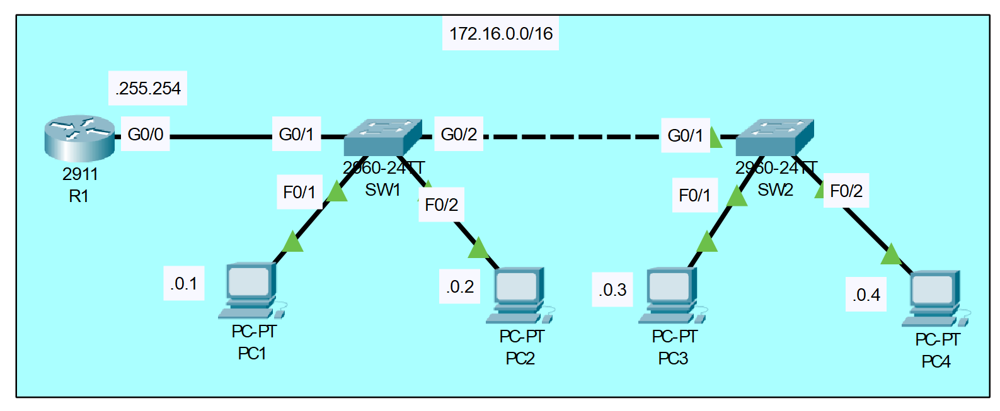

# Interface Configuration

## Introduction

### Packet Tracer

[Download Day 09 Lab - Interface Configuration](/JITL/Day%2009%20Lab%20-%20Interface%20Configuration.pkt){:download="Day 09 Lab - Interface Configuration"}

### Topology

<figure markdown>
  { width="800" }
  <figcaption></figcaption>
</figure>

### Questions

1. Configure the hostname of R1, SW1, and SW2
2. Configure the appropriate IP addresses on R1, PC1, PC2, PC3, PC4
3. Manually configure the speed and duplex on interfaces connected to other networking devices (not end hosts)
4. Configure appropriate descriptions on each interface
5. Disable interfaces which are not connected to other devices

## Answers

??? "1. Configure the hostname of R1, SW1, and SW2"

    === "R1"
        
        ``` bash
        Router>en
        Router#conf t
        Enter configuration commands, one per line.  End with CNTL/Z.
        Router(config)#hostname R1
        R1(config)#
        ```

    === "SW1"
        
        ``` bash
        Switch>en
        Switch#conf t
        Enter configuration commands, one per line.  End with CNTL/Z.
        Switch(config)#hostname SW2
        SW2(config)#
        ```

    === "SW2"
        
        ``` bash
        Switch>en
        Switch#conf t
        Enter configuration commands, one per line.  End with CNTL/Z.
        Switch(config)#hostname SW2
        SW2(config)#
        ```

??? "2. Configure the appropriate IP addresses on R1, PC1, PC2, PC3, PC4"

    R1 G0/0 Interface
    ``` bash
    R1(config)#int g0/0
    R1(config-if)#ip address 172.16.255.254 255.255.0.0
    R1(config-if)#no shut

    R1(config-if)#
    %LINK-5-CHANGED: Interface GigabitEthernet0/0, changed state to up

    %LINEPROTO-5-UPDOWN: Line protocol on Interface GigabitEthernet0/0, changed state to up

    R1(config-if)#
    ```

??? "3. Manually configure the speed and duplex on interfaces connected to other networking devices (not end hosts)"

    === "SW1"
        
        First let's check out the interfaces
        ``` bash
        SW2#show int status
        Port      Name               Status       Vlan       Duplex  Speed Type
        Fa0/1                        connected    1          auto    auto  10/100BaseTX
        Fa0/2                        connected    1          auto    auto  10/100BaseTX
        Fa0/3                        notconnect   1          auto    auto  10/100BaseTX
        Fa0/4                        notconnect   1          auto    auto  10/100BaseTX
        Fa0/5                        notconnect   1          auto    auto  10/100BaseTX
        Fa0/6                        notconnect   1          auto    auto  10/100BaseTX
        Fa0/7                        notconnect   1          auto    auto  10/100BaseTX
        Fa0/8                        notconnect   1          auto    auto  10/100BaseTX
        Fa0/9                        notconnect   1          auto    auto  10/100BaseTX
        Fa0/10                       notconnect   1          auto    auto  10/100BaseTX
        Fa0/11                       notconnect   1          auto    auto  10/100BaseTX
        Fa0/12                       notconnect   1          auto    auto  10/100BaseTX
        Fa0/13                       notconnect   1          auto    auto  10/100BaseTX
        Fa0/14                       notconnect   1          auto    auto  10/100BaseTX
        Fa0/15                       notconnect   1          auto    auto  10/100BaseTX
        Fa0/16                       notconnect   1          auto    auto  10/100BaseTX
        Fa0/17                       notconnect   1          auto    auto  10/100BaseTX
        Fa0/18                       notconnect   1          auto    auto  10/100BaseTX
        Fa0/19                       notconnect   1          auto    auto  10/100BaseTX
        Fa0/20                       notconnect   1          auto    auto  10/100BaseTX
        Fa0/21                       notconnect   1          auto    auto  10/100BaseTX
        Fa0/22                       notconnect   1          auto    auto  10/100BaseTX
        Fa0/23                       notconnect   1          auto    auto  10/100BaseTX
        Fa0/24                       notconnect   1          auto    auto  10/100BaseTX
        Gig0/1                       connected    1          auto    auto  10/100BaseTX
        Gig0/2                       connected    1          auto    auto  10/100BaseTX

        SW2# 
        ```
        
        Note: 'show interface status' works on switches, not routers
        
        Note: 'Status' column shows connected/notconnect, and not Disabled because these are switch interfaces and not shutdown by default.
        
        Note: All default settings for duplex/speed

        Now let's configure the G0/1 interface that connected to R1

        ``` bash
        SW2(config)#int g0/1
        SW2(config-if)#speed 1000
        SW2(config-if)#duplex full
        SW2(config-if)#
        ```

??? "5. Disable interfaces which are not connected to other devices"

    Disable Interfaces 
    
    ``` bash
    SW2(config)#int range f0/2-24
    SW2(config-if-range)#shut


    %LINK-5-CHANGED: Interface FastEthernet0/3, changed state to administratively down

    %LINK-5-CHANGED: Interface FastEthernet0/4, changed state to administratively down

    %LINK-5-CHANGED: Interface FastEthernet0/5, changed state to administratively down

    %LINK-5-CHANGED: Interface FastEthernet0/6, changed state to administratively down

    %LINK-5-CHANGED: Interface FastEthernet0/7, changed state to administratively down

    %LINK-5-CHANGED: Interface FastEthernet0/8, changed state to administratively down

    %LINK-5-CHANGED: Interface FastEthernet0/9, changed state to administratively down

    %LINK-5-CHANGED: Interface FastEthernet0/10, changed state to administratively down

    %LINK-5-CHANGED: Interface FastEthernet0/11, changed state to administratively down

    %LINK-5-CHANGED: Interface FastEthernet0/12, changed state to administratively down

    %LINK-5-CHANGED: Interface FastEthernet0/13, changed state to administratively down

    %LINK-5-CHANGED: Interface FastEthernet0/14, changed state to administratively down

    %LINK-5-CHANGED: Interface FastEthernet0/15, changed state to administratively down

    %LINK-5-CHANGED: Interface FastEthernet0/16, changed state to administratively down

    %LINK-5-CHANGED: Interface FastEthernet0/17, changed state to administratively down

    %LINK-5-CHANGED: Interface FastEthernet0/18, changed state to administratively down

    %LINK-5-CHANGED: Interface FastEthernet0/19, changed state to administratively down

    %LINK-5-CHANGED: Interface FastEthernet0/20, changed state to administratively down

    %LINK-5-CHANGED: Interface FastEthernet0/21, changed state to administratively down

    %LINK-5-CHANGED: Interface FastEthernet0/22, changed state to administratively down

    %LINK-5-CHANGED: Interface FastEthernet0/23, changed state to administratively down

    %LINK-5-CHANGED: Interface FastEthernet0/24, changed state to administratively down
    SW2(config-if-range)#
    %LINK-5-CHANGED: Interface FastEthernet0/2, changed state to administratively down

    %LINEPROTO-5-UPDOWN: Line protocol on Interface FastEthernet0/2, changed state to down

    SW2(config-if-range)#
    ```

    Confirm interface status

    ``` bash
    SW2#sh int stat
    Port      Name               Status       Vlan       Duplex  Speed Type
    Fa0/1                        connected    1          auto    auto  10/100BaseTX
    Fa0/2                        disabled 1          auto    auto  10/100BaseTX
    Fa0/3                        disabled 1          auto    auto  10/100BaseTX
    Fa0/4                        disabled 1          auto    auto  10/100BaseTX
    Fa0/5                        disabled 1          auto    auto  10/100BaseTX
    Fa0/6                        disabled 1          auto    auto  10/100BaseTX
    Fa0/7                        disabled 1          auto    auto  10/100BaseTX
    Fa0/8                        disabled 1          auto    auto  10/100BaseTX
    Fa0/9                        disabled 1          auto    auto  10/100BaseTX
    Fa0/10                       disabled 1          auto    auto  10/100BaseTX
    Fa0/11                       disabled 1          auto    auto  10/100BaseTX
    Fa0/12                       disabled 1          auto    auto  10/100BaseTX
    Fa0/13                       disabled 1          auto    auto  10/100BaseTX
    Fa0/14                       disabled 1          auto    auto  10/100BaseTX
    Fa0/15                       disabled 1          auto    auto  10/100BaseTX
    Fa0/16                       disabled 1          auto    auto  10/100BaseTX
    Fa0/17                       disabled 1          auto    auto  10/100BaseTX
    Fa0/18                       disabled 1          auto    auto  10/100BaseTX
    Fa0/19                       disabled 1          auto    auto  10/100BaseTX
    Fa0/20                       disabled 1          auto    auto  10/100BaseTX
    Fa0/21                       disabled 1          auto    auto  10/100BaseTX
    Fa0/22                       disabled 1          auto    auto  10/100BaseTX
    Fa0/23                       disabled 1          auto    auto  10/100BaseTX
    Fa0/24                       disabled 1          auto    auto  10/100BaseTX
    Gig0/1                       connected    1          auto    a-100010/100BaseTX
    Gig0/2                       connected    1          auto    auto  10/100BaseTX

    SW2# 
    ```

## Commands

* `speed <speed>` - Manually set speed
* `duplex <duplex>` - Manually set duplex

* `no speed` - Change back to Auto
* `no duplex` - Change back to Auto
  