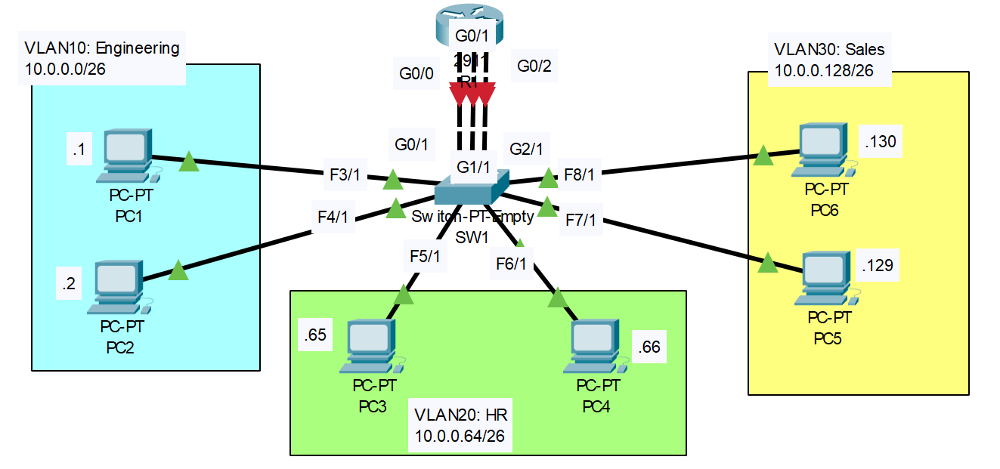

# VLANS (Part 1)

## Introduction

### Packet Tracer

[Download Day 16 Lab - VLANS (Part 1)](/JITL/Day%2016%20Lab%20-%20VLANs%20(Part%201).pkt){:download="Day 16 Lab - VLANS (Part 1)"}

### Topology

<figure markdown>
  { width="800" }
  <figcaption></figcaption>
</figure>

### Questions

1. Configure the correct IP address/subnet mask on each PC. Set the gateway address as the LAST USABLE address of the subnet.
2. Configure one interface on R1 for each VLAN. Make sure the IP addresses are the gateway address you configured on the PCs.
3. Configure SW1's interfaces in the proper VLANs. Remember the interfaces that connect to R1! Name the VLANs (Engeering, HR, Sales)
4. Ping between the PCs to check connectivity. Send a broadcast ping from a PC (ping the subnet broadcast address), and see which PCs devices receive the broadcast (use Packet Tracer's 'Simulation Mode')

## Answers

??? "1. Configure the correct IP address/subnet mask on each PC. Set the gateway address as the LAST USABLE address of the subnet."

    === "VLAN 10"
        
        ``` bash
        Network: 10.0.0.0/26

        255.255.255.11|000000 (11000000 = 192)
        Mask = 255.255.255.192

        10.0.0.00|000000 (00000000 = 0)
        10.0.0.00|111111 (00111111 = 63)

        Network ID: 10.0.0.0
        Host Range: 10.0.0.1 - 
                    10.0.0.62
        Broadcast:  10.0.0.63

        PC1
        IP      10.0.0.1
        Mask    255.255.255.192   
        GW      10.0.0.62

        PC1
        IP      10.0.0.2
        Mask    255.255.255.192   
        GW      10.0.0.62

        ```

    === "VLAN20"
        
        ``` bash
        Network: 10.0.0.64/26

        255.255.255.11|000000 (11000000 = 192)
        Mask = 255.255.255.192

        10.0.0.01|000000 (01000000 = 64)
        10.0.0.01|111111 (01111111 = 127)

        Network ID: 10.0.0.64
        Host Range: 10.0.0.65 - 
                    10.0.0.126
        Broadcast:  10.0.0.127

        PC3
        IP      10.0.0.65
        Mask    255.255.255.192   
        GW      10.0.0.126

        PC4
        IP      10.0.0.66
        Mask    255.255.255.192   
        GW      10.0.0.126

        ```

    === "VLAN30"
        
        ``` bash
        Network: 10.0.0.128/26

        255.255.255.11|000000 (11000000 = 192)
        Mask = 255.255.255.192

        10.0.0.10|000000 (01000000 = 128)
        10.0.0.10|111111 (01111111 = 191)

        Network ID: 10.0.0.128
        Host Range: 10.0.0.129 - 
                    10.0.0.190
        Broadcast:  10.0.0.191

        PC5
        IP      10.0.0.129
        Mask    255.255.255.192   
        GW      10.0.0.190

        PC6
        IP      10.0.0.130
        Mask    255.255.255.192   
        GW      10.0.0.190

        ```

??? "2. Configure one interface on R1 for each VLAN. Make sure the IP addresses are the gateway address you configured on the PCs."

    ``` bash 
    R1>en
    R1#conf t
    
    ! R1's Gi0/0 interface 
    R1(config)#int g0/0
    R1(config-if)#ip add 10.0.0.62 255.255.255.192
    R1(config-if)#no shut

    ! R1's Gi0/1 interface 
    R1(config-if)#int g0/1
    R1(config-if)#ip add 10.0.0.126 255.255.255.192
    R1(config-if)#no shut

    ! R1's Gi0/2 interface 
    R1(config-if)#int g0/2
    R1(config-if)#ip add 10.0.0.190 255.255.255.192
    R1(config-if)#no shut
    ```

??? "3. Configure SW1's interfaces in the proper VLANs. Remember the interfaces that connect to R1! Name the VLANs (Engeering, HR, Sales)"

    ``` bash 
    SW1>en
    SW1#conf t

    ! VLAN10
    SW1(config)#int range g0/1, f3/1, f4/1
    SW1(config-if-range)#switchport mode access
    SW1(config-if-range)#switchport access vlan 10
    % Access VLAN does not exist. Creating vlan 10

    ! VLAN20
    SW1(config-if-range)#int range g1/1, f5/1, f6/1
    SW1(config-if-range)#switchport mode access
    SW1(config-if-range)#switchport access vlan 20
    % Access VLAN does not exist. Creating vlan 20


    ! VLAN30
    SW1(config-if-range)#int range g2/1, f7/1, f8/1
    SW1(config-if-range)#switchport mode access 
    SW1(config-if-range)#switchport access vlan 30
    % Access VLAN does not exist. Creating vlan 30

    ! Verify the correct VLANS
    SW1(config-if-range)#end
    SW1#show vlan brief

    VLAN Name                             Status    Ports
    ---- -------------------------------- --------- -------------------------------
    1    default                          active    Fa9/1
    10   VLAN0010                         active    Gig0/1, Fa3/1, Fa4/1
    20   VLAN0020                         active    Gig1/1, Fa5/1, Fa6/1
    30   VLAN0030                         active    Gig2/1, Fa7/1, Fa8/1
    1002 fddi-default                     active    
    1003 token-ring-default               active    
    1004 fddinet-default                  active    
    1005 trnet-default                    active    
    SW1#

    ! Naming the VLANS
    SW1#conf t

    SW1(config)#vlan 10
    SW1(config-vlan)#name ENGINEERING

    SW1(config-vlan)#vlan 20
    SW1(config-vlan)#name HR

    SW1(config-vlan)#vlan 30
    SW1(config-vlan)#name SALES

    SW1(config-vlan)#do show vlan brief

    VLAN Name                             Status    Ports
    ---- -------------------------------- --------- -------------------------------
    1    default                          active    Fa9/1
    10   ENGINEERING                      active    Gig0/1, Fa3/1, Fa4/1
    20   HR                               active    Gig1/1, Fa5/1, Fa6/1
    30   SALES                            active    Gig2/1, Fa7/1, Fa8/1
    1002 fddi-default                     active    
    1003 token-ring-default               active    
    1004 fddinet-default                  active    
    1005 trnet-default                    active    
    SW1(config-vlan)#
    ```

## Commands

* `switchport mode access` - setting switching as an access port
* `switchport access vlan 10` - assigning switchport to vlan 10
* `show vlan brief` - Helps verify VLAN
  