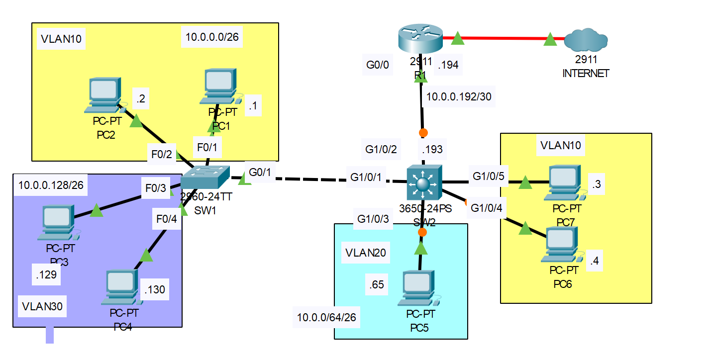

# VLANS (Part 3) - Routing in the LAN: Multilayer Switching

## Introduction

### Packet Tracer

[Download Day 18 Lab - VLANS (Part 3)](../assets/packet-tracer-files/Day%2018%20Lab%20-%20Multilayer%20Switching.pkt){:download="Day 18 Lab - VLANS (Part 3).pkt"}

### Topology

<figure markdown>
  { width="800" }
  <figcaption></figcaption>
</figure>

### Questions

All devices are preconfigured from the end of Day 17's lab (SW2 has been replaced with a multilayer switch):
Hosts are in the correct VLANs.
SW1-SW2 are connected via trunk.
R1-SW2 are connected via ROAS.

1. Replace the ROAS configuration on R1-SW2 with a point-to-point Layer 3 connection. Use the IP addresses given in the network diagram. Configure a default route on SW2, with R1's G0/0 interface as the next hop.
2. Configure SVIs on SW2, one for each VLAN. Assign the last usable IP address of each subnet to the appropriate SVI.
3. Test inter-VLAN connectivity by pinging between VLANs.
4. Test connectivity to the Internet by pinging 1.1.1.1 (Routes have already been configured on R1 and the Internet router)

## Answers

??? "1. Replace the ROAS configuration on R1-SW2 with a point-to-point Layer 3 connection. Use the IP addresses given in the network diagram. Configure a default route on SW2, with R1's G0/0 interface as the next hop."

    === "R1"
        
        ``` bash
        ! First let's check out the interfaces on R1. We'll see the 3 previously created sub-ints
        R1#show ip int bri

        Interface              IP-Address      OK? Method Status                Protocol 
        GigabitEthernet0/0     unassigned      YES NVRAM  up                    up 
        GigabitEthernet0/0.10  10.0.0.62       YES manual up                    up 
        GigabitEthernet0/0.20  10.0.0.126      YES manual up                    up 
        GigabitEthernet0/0.30  10.0.0.190      YES manual up                    up 
        GigabitEthernet0/1     unassigned      YES NVRAM  administratively down down 
        GigabitEthernet0/2     unassigned      YES NVRAM  administratively down down 
        GigabitEthernet0/0/0   1.1.1.2         YES manual up                    up 
        Vlan1                  unassigned      YES unset  administratively down down

        ! Next, lets delete them
        R1#conf t
        R1(config)#no int g0/0.10
        R1(config)#no int g0/0.20
        R1(config)#no int g0/0.30

        ! Give g0/0 an ip address
        R1(config)#int g0/0
        R1(config-if)#ip add 10.0.0.194 255.255.255.252
        ```

    === "SW2"
        
        ``` bash
        ! Take a look at the running config of SW2. 
        SW2>en
        SW2#show run
        !
        !
        !
        interface GigabitEthernet1/0/1
        switchport trunk allowed vlan 10,30
        switchport mode trunk
        !
        interface GigabitEthernet1/0/2
        switchport trunk allowed vlan 10,20,30
        switchport mode trunk
        !
        interface GigabitEthernet1/0/3
        switchport access vlan 20
        switchport mode access
        switchport nonegotiate
        !
        interface GigabitEthernet1/0/4
        switchport access vlan 10
        switchport mode access
        switchport nonegotiate
        !
        interface GigabitEthernet1/0/5
        switchport access vlan 10
        switchport mode access
        switchport nonegotiate
        !
        !
        !
        ```

        Let's return the G1/0/2 interface to the default configuration before moving on.

        ``` bash
        SW2#conf t
        SW2(config)#default int g1/0/2
        Building configuration...


        Interface GigabitEthernet1/0/2 set to default configuration
        SW2(config)#
        ```

        ``` bash
        ! Assigning IP address to SW2 interface
        SW2>en
        SW2#conf t

        SW2(config)#int g1/0/2
        SW2(config-if)#ip ?
        access-group  Specify access control for packets
        arp           Configure ARP features
        dhcp          Configure DHCP parameters for this interface
        ! We notice that there's no ip address option for this interface. That's because it's still in layer 2 mode

        ! Placing into layer 3 mode
        SW2(config-if)#no switchport
        SW2(config-if)#ip ?
        access-group     Specify access control for packets
        address          Set the IP address of an interface
        authentication   authentication subcommands
        flow             NetFlow Related commands
        hello-interval   Configures IP-EIGRP hello interval
        helper-address   Specify a destination address for UDP broadcasts
        inspect          Apply inspect name
        ips              Create IPS rule
        mtu              Set IP Maximum Transmission Unit
        ospf             OSPF interface commands
        proxy-arp        Enable proxy ARP
        route-cache      Enable fast-switching cache for outgoing packets
        split-horizon    Perform split horizon
        summary-address  Perform address summarization

        SW2(config-if)#ip address 10.0.0.193 255.255.255.252
        ```

        Finally, we have to add a default route to SW2. We'll first check the routing table

        ``` bash
        SW2#
        SW2#sh ip route
        Default gateway is not set

        Host               Gateway           Last Use    Total Uses  Interface
        ICMP redirect cache is empty

        SW2#
        ```

        We notice that it's empty even though we should see the connected and local routes for the interface we configured. This is because we haven't enable IP ROUTING on the switch yet.

        ``` bash
        SW2(config)#ip routing
        SW2(config)#do show ip route
        Codes: C - connected, S - static, I - IGRP, R - RIP, M - mobile, B - BGP
            D - EIGRP, EX - EIGRP external, O - OSPF, IA - OSPF inter area
            N1 - OSPF NSSA external type 1, N2 - OSPF NSSA external type 2
            E1 - OSPF external type 1, E2 - OSPF external type 2, E - EGP
            i - IS-IS, L1 - IS-IS level-1, L2 - IS-IS level-2, ia - IS-IS inter area
            * - candidate default, U - per-user static route, o - ODR
            P - periodic downloaded static route

        Gateway of last resort is not set

            10.0.0.0/30 is subnetted, 1 subnets
        C       10.0.0.192 is directly connected, GigabitEthernet1/0/2

        SW2(config)#
        ! Note: This may be a packet tracer issue but a local route (/32) should appear too
        ```

        Now we can finally configure the default route

        ``` bash
        SW2(config)#ip route 0.0.0.0 0.0.0.0 10.0.0.194
        SW2(config)#do show ip route
        Codes: C - connected, S - static, I - IGRP, R - RIP, M - mobile, B - BGP
            D - EIGRP, EX - EIGRP external, O - OSPF, IA - OSPF inter area
            N1 - OSPF NSSA external type 1, N2 - OSPF NSSA external type 2
            E1 - OSPF external type 1, E2 - OSPF external type 2, E - EGP
            i - IS-IS, L1 - IS-IS level-1, L2 - IS-IS level-2, ia - IS-IS inter area
            * - candidate default, U - per-user static route, o - ODR
            P - periodic downloaded static route

        Gateway of last resort is 10.0.0.194 to network 0.0.0.0

            10.0.0.0/30 is subnetted, 1 subnets
        C       10.0.0.192 is directly connected, GigabitEthernet1/0/2
        S*   0.0.0.0/0 [1/0] via 10.0.0.194

        SW2(config)#
        ```

        ??? tip "SW2 brief"

            Basically we're just defaulting g1/0/2, switching that interface to layer 3 and giving it an ip address, then enabling routing on the switch.

            ``` bash
            SW2>en
            SW2#conf t

            SW2(config)#default int g1/0/2     

            SW2(config)#int g1/0/2
            SW2(config-if)#no switchport
            SW2(config-if)#ip address 10.0.0.193 255.255.255.252
            SW2(config-if)#exit

            SW2(config)#ip routing
            SW2(config)#ip route 0.0.0.0 0.0.0.0 10.0.0.194
            ```

??? "2. Configure SVIs on SW2, one for each VLAN. Assign the last usable IP address of each subnet to the appropriate SVI."

    First, we'll check to see if the vlan's exist on the switch

    ``` bash
    SW2>en
    SW2#conf t

    SW2(config)#do show vlan brief

    VLAN Name                             Status    Ports
    ---- -------------------------------- --------- -------------------------------
    1    default                          active    Gig1/0/6, Gig1/0/7, Gig1/0/8, Gig1/0/9
                                                    Gig1/0/10, Gig1/0/11, Gig1/0/12, Gig1/0/13
                                                    Gig1/0/14, Gig1/0/15, Gig1/0/16, Gig1/0/17
                                                    Gig1/0/18, Gig1/0/19, Gig1/0/20, Gig1/0/21
                                                    Gig1/0/22, Gig1/0/23, Gig1/0/24, Gig1/1/1
                                                    Gig1/1/2, Gig1/1/3, Gig1/1/4
    10   VLAN0010                         active    Gig1/0/4, Gig1/0/5
    20   VLAN0020                         active    Gig1/0/3
    30   VLAN0030                         active    
    1002 fddi-default                     active    
    1003 token-ring-default               active    
    1004 fddinet-default                  active    
    1005 trnet-default                    active    
    SW2(config)#
    ```
    
    They do. Next lets configure the SVIs and make sure they are up/up

    ``` bash
    ! Configure SVIs with ip addresses
    SW2(config)#int vlan 10
    SW2(config-if)#ip add 10.0.0.62 255.255.255.192
    SW2(config-if)#int vlan 20
    SW2(config-if)#ip add 10.0.0.126 255.255.255.192
    SW2(config-if)#int vlan 30
    SW2(config-if)#ip add 10.0.0.190 255.255.255.192
    SW2(config-if)#exit

    ! Make sure they are up (we may have to do a 'no shut' on the svi first in real life)
    SW2(config)#do show ip int bri
    Interface              IP-Address      OK? Method Status                Protocol 
    GigabitEthernet1/0/1   unassigned      YES unset  up                    up 
    GigabitEthernet1/0/2   10.0.0.193      YES manual up                    up 
    GigabitEthernet1/0/3   unassigned      YES unset  up                    up 
    GigabitEthernet1/0/4   unassigned      YES unset  up                    up 
    GigabitEthernet1/0/5   unassigned      YES unset  up                    up 
    GigabitEthernet1/0/6   unassigned      YES unset  down                  down 
    GigabitEthernet1/0/7   unassigned      YES unset  down                  down 
    GigabitEthernet1/0/8   unassigned      YES unset  down                  down 
    GigabitEthernet1/0/9   unassigned      YES unset  down                  down 
    GigabitEthernet1/0/10  unassigned      YES unset  down                  down 
    GigabitEthernet1/0/11  unassigned      YES unset  down                  down 
    GigabitEthernet1/0/12  unassigned      YES unset  down                  down 
    GigabitEthernet1/0/13  unassigned      YES unset  down                  down 
    GigabitEthernet1/0/14  unassigned      YES unset  down                  down 
    GigabitEthernet1/0/15  unassigned      YES unset  down                  down 
    GigabitEthernet1/0/16  unassigned      YES unset  down                  down 
    GigabitEthernet1/0/17  unassigned      YES unset  down                  down 
    GigabitEthernet1/0/18  unassigned      YES unset  down                  down 
    GigabitEthernet1/0/19  unassigned      YES unset  down                  down 
    GigabitEthernet1/0/20  unassigned      YES unset  down                  down 
    GigabitEthernet1/0/21  unassigned      YES unset  down                  down 
    GigabitEthernet1/0/22  unassigned      YES unset  down                  down 
    GigabitEthernet1/0/23  unassigned      YES unset  down                  down 
    GigabitEthernet1/0/24  unassigned      YES unset  down                  down 
    GigabitEthernet1/1/1   unassigned      YES unset  down                  down 
    GigabitEthernet1/1/2   unassigned      YES unset  down                  down 
    GigabitEthernet1/1/3   unassigned      YES unset  down                  down 
    GigabitEthernet1/1/4   unassigned      YES unset  down                  down 
    Vlan1                  unassigned      YES unset  administratively down down 
    Vlan10                 10.0.0.62       YES manual up                    up 
    Vlan20                 10.0.0.126      YES manual up                    up 
    Vlan30                 10.0.0.190      YES manual up                    up
    SW2(config)#
    ```
    

## Another way of looking at Layer 3 Switched Virtual Interfaces

<figure markdown>
  { width="800" }
  <figcaption></figcaption>
</figure>

## Commands

* `default g1/0/2` - returning int to default configuration
* `no switchport` - placing a switchport into layer 3 mode (multilayer switch)
  