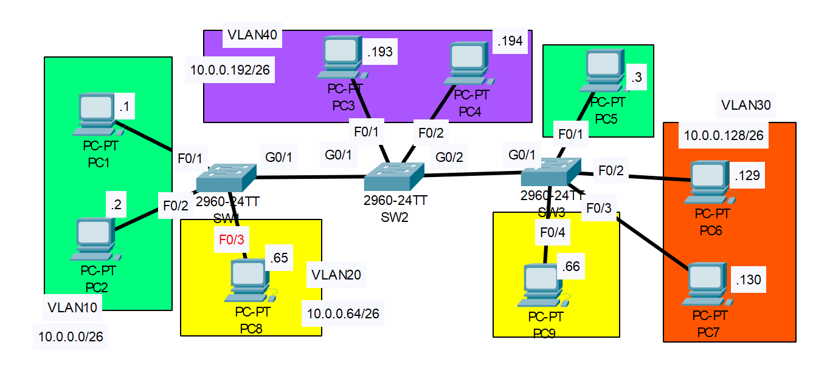

# DTP and VTP

## Introduction

### Packet Tracer

[Download Day 19 Lab - Analyzing STP](../assets/packet-tracer-files/Day%2019%20Lab%20-%20DTP%20_%20VTP.pkt){:download="Day 19 Lab - Analyzing STP.pkt"}

### Topology

<figure markdown>
  { width="800" }
  <figcaption></figcaption>
</figure>

### Questions

1. Configure the switchports connecting switches as trunk ports. Disable DTP on the ports. Confirm the administrative and operational mode of each interface.
2. Configure SW1 in VTP domain CCNA. Create VLANs 10, 20, and 30 on SW1. Have SW2 and SW3 added VLANs 10, 20, and 30?
3. Configure SW2 in VTP transparent mode. Add VLAN40 to SW2. Is VLAN40 added to the VLAN database of SW1/SW3?
4. Configure SW3 in VTP client mode. Try to configure VLAN50 on SW3.  Is it added?
5. Configure all switchports connected to hosts in the correct VLAN. Manually configure them as access ports. Is DTP still enabled on the switchports?

## Answers

??? "1. Configure the switchports connecting switches as trunk ports. Disable DTP on the ports. Confirm the administrative and operational mode of each interface."

    === "SW1"

        ``` bash
        SW1>
        SW1>en
        SW1#conf t
        SW1(config)#int g0/1
        SW1(config-if)#do show int g0/1 switchport

        Name: Gig0/1
        Switchport: Enabled
        Administrative Mode: dynamic auto
        Operational Mode: static access
        Administrative Trunking Encapsulation: dot1q
        Operational Trunking Encapsulation: native
        Negotiation of Trunking: On
        Access Mode VLAN: 1 (default)
        Trunking Native Mode VLAN: 1 (default)
        Voice VLAN: none
        Administrative private-vlan host-association: none
        Administrative private-vlan mapping: none
        Administrative private-vlan trunk native VLAN: none
        Administrative private-vlan trunk encapsulation: dot1q
        Administrative private-vlan trunk normal VLANs: none
        Administrative private-vlan trunk private VLANs: none
        Operational private-vlan: none
        Trunking VLANs Enabled: All
        Pruning VLANs Enabled: 2-1001
        Capture Mode Disabled
        Capture VLANs Allowed: ALL
        Protected: false
        Unknown unicast blocked: disabled
        Unknown multicast blocked: disabled
        Appliance trust: none

        SW1(config-if)#
        ```

        We see that:

        * `Administrative Mode: dynamic auto` - dynamic auto will be the default
        * `Operational Mode: static access`
        * `Negotiation of Trunking: On` - This means that DTP frames are being sent out

        Now, configure the trunk

        ``` bash
        SW1(config-if)#int g0/1
        SW1(config-if)#switchport mode trunk

        SW1(config-if)#do show int g0/1 switchport

        Name: Gig0/1
        Switchport: Enabled
        Administrative Mode: trunk
        Operational Mode: trunk
        Administrative Trunking Encapsulation: dot1q
        Operational Trunking Encapsulation: dot1q
        Negotiation of Trunking: On
        Access Mode VLAN: 1 (default)
        Trunking Native Mode VLAN: 1 (default)
        Voice VLAN: none
        Administrative private-vlan host-association: none
        Administrative private-vlan mapping: none
        Administrative private-vlan trunk native VLAN: none
        Administrative private-vlan trunk encapsulation: dot1q
        Administrative private-vlan trunk normal VLANs: none
        Administrative private-vlan trunk private VLANs: none
        Operational private-vlan: none
        Trunking VLANs Enabled: All
        Pruning VLANs Enabled: 2-1001
        Capture Mode Disabled
        Capture VLANs Allowed: ALL
        Protected: false
        Unknown unicast blocked: disabled
        Unknown multicast blocked: disabled
        Appliance trust: none

        SW1(config-if)#
        ```
        We see that:

        * `Administrative Mode: trunk`
        * `Operational Mode: trunk`
        * `Negotiation of Trunking: On` - Still on

        Lets disable trunking now

        ``` bash
        SW1(config-if)# switchport nonegotiate 

        SW1(config-if)#do show int g0/1 switchport

        Name: Gig0/1
        Switchport: Enabled
        Administrative Mode: trunk
        Operational Mode: trunk
        Administrative Trunking Encapsulation: dot1q
        Operational Trunking Encapsulation: dot1q
        Negotiation of Trunking: Off
        Access Mode VLAN: 1 (default)
        Trunking Native Mode VLAN: 1 (default)
        Voice VLAN: none
        Administrative private-vlan host-association: none
        Administrative private-vlan mapping: none
        Administrative private-vlan trunk native VLAN: none
        Administrative private-vlan trunk encapsulation: dot1q
        Administrative private-vlan trunk normal VLANs: none
        Administrative private-vlan trunk private VLANs: none
        Operational private-vlan: none
        Trunking VLANs Enabled: All
        Pruning VLANs Enabled: 2-1001
        Capture Mode Disabled
        Capture VLANs Allowed: ALL
        Protected: false

        SW1(config-if)#
        ```

        We see that:

        * `Administrative Mode: trunk`
        * `Operational Mode: trunk`
        * `Negotiation of Trunking: Off`

    === "SW2"
    
        ``` bash
        SW2>en
        SW2#conf t
        SW2(config)#int range g0/1-2
        SW2(config-if-range)#switchport mode trunk
        SW2(config-if-range)#switchport nonegotiate
        ```
        
        ??? success "Verify"

            ```bash

            SW2(config-if)#do show int g0/1 switchport

            Name: Gig0/1
            Switchport: Enabled
            Administrative Mode: trunk
            Operational Mode: trunk
            Administrative Trunking Encapsulation: dot1q
            Operational Trunking Encapsulation: dot1q
            Negotiation of Trunking: Off
            Access Mode VLAN: 1 (default)
            Trunking Native Mode VLAN: 1 (default)
            Voice VLAN: none
            Administrative private-vlan host-association: none
            Administrative private-vlan mapping: none
            Administrative private-vlan trunk native VLAN: none
            Administrative private-vlan trunk encapsulation: dot1q
            Administrative private-vlan trunk normal VLANs: none
            Administrative private-vlan trunk private VLANs: none
            Operational private-vlan: none
            Trunking VLANs Enabled: All
            Pruning VLANs Enabled: 2-1001
            Capture Mode Disabled
            Capture VLANs Allowed: ALL
            Protected: false
            ```

    === "SW3"
    
        ``` bash
        SW3>en
        SW3#conf t
        SW3(config)#int g0/1
        SW3(config-if)#switchport mode trunk
        SW3(config-if)#switchport nonegotiate 
        SW3(config-if)#
        ```

        ??? success "Verify"

            ```bash

            SW3(config-if)#do show int g0/1 switchport

            Name: Gig0/1
            Switchport: Enabled
            Administrative Mode: trunk
            Operational Mode: trunk
            Administrative Trunking Encapsulation: dot1q
            Operational Trunking Encapsulation: dot1q
            Negotiation of Trunking: Off
            Access Mode VLAN: 1 (default)
            Trunking Native Mode VLAN: 1 (default)
            Voice VLAN: none
            Administrative private-vlan host-association: none
            Administrative private-vlan mapping: none
            Administrative private-vlan trunk native VLAN: none
            Administrative private-vlan trunk encapsulation: dot1q
            Administrative private-vlan trunk normal VLANs: none
            Administrative private-vlan trunk private VLANs: none
            Operational private-vlan: none
            Trunking VLANs Enabled: All
            Pruning VLANs Enabled: 2-1001
            Capture Mode Disabled
            Capture VLANs Allowed: ALL
            Protected: false
            ```

??? "2. Configure SW1 in VTP domain CCNA. Create VLANs 10, 20, and 30 on SW1. Have SW2 and SW3 added VLANs 10, 20, and 30?"

    First, let's look at the current VTP status of the switch

    ``` bash
    SW1#show vtp status
    VTP Version                     : 1
    Configuration Revision          : 0
    Maximum VLANs supported locally : 255
    Number of existing VLANs        : 5
    VTP Operating Mode              : Server
    VTP Domain Name                 : 
    VTP Pruning Mode                : Disabled
    VTP V2 Mode                     : Disabled
    VTP Traps Generation            : Disabled
    MD5 digest                      : 0x7D 0x5A 0xA6 0x0E 0x9A 0x72 0xA0 0x3A 
    Configuration last modified by 0.0.0.0 at 0-0-00 00:00:00
    Local updater ID is 0.0.0.0 (no valid interface found)
    SW1#
    ```
    We see that:

    * `VTP Version                     : 1` - Version 1.    
    * `VTP Domain Name                 : ` - Blank, as expected 
    * `VTP V2 Mode                     : Disabled` - Disabled, as expected 

    Now, let's configure VTP:

    ``` bash
    SW1#conf t

    SW1(config)#vtp domain CCNA
    Changing VTP domain name from NULL to CCNA

    SW1(config)#vlan 10
    SW1(config-vlan)#vlan 20
    SW1(config-vlan)#vlan 30
    
    SW1#show vtp status

    VTP Version                     : 1
    Configuration Revision          : 3
    Maximum VLANs supported locally : 255
    Number of existing VLANs        : 8
    VTP Operating Mode              : Server
    VTP Domain Name                 : CCNA
    VTP Pruning Mode                : Disabled
    VTP V2 Mode                     : Disabled
    VTP Traps Generation            : Disabled
    MD5 digest                      : 0x67 0xC8 0x45 0x83 0xFA 0xFD 0xCB 0xFB 
    Configuration last modified by 0.0.0.0 at 2-28-93 10:27:09
    Local updater ID is 0.0.0.0 (no valid interface found)

    SW1#
    ```

    * `Configuration Revision          : 3` - 3 means that 3 vlans have been added.

    ??? abstract "Has SW2 added these VLANS?"

        Yes

        ``` bash
        SW2#show vtp status
        
        VTP Version                     : 1
        Configuration Revision          : 3
        Maximum VLANs supported locally : 255
        Number of existing VLANs        : 8
        VTP Operating Mode              : Server
        VTP Domain Name                 : CCNA
        VTP Pruning Mode                : Disabled
        VTP V2 Mode                     : Disabled
        VTP Traps Generation            : Disabled
        MD5 digest                      : 0x67 0xC8 0x45 0x83 0xFA 0xFD 0xCB 0xFB 
        Configuration last modified by 0.0.0.0 at 2-28-93 10:27:09
        Local updater ID is 0.0.0.0 (no valid interface found)

        SW2#show vlan bri

        VLAN Name                             Status    Ports
        ---- -------------------------------- --------- -------------------------------
        1    default                          active    Fa0/1, Fa0/2, Fa0/3, Fa0/4
                                                        Fa0/5, Fa0/6, Fa0/7, Fa0/8
                                                        Fa0/9, Fa0/10, Fa0/11, Fa0/12
                                                        Fa0/13, Fa0/14, Fa0/15, Fa0/16
                                                        Fa0/17, Fa0/18, Fa0/19, Fa0/20
                                                        Fa0/21, Fa0/22, Fa0/23, Fa0/24
        10   VLAN0010                         active    
        20   VLAN0020                         active    
        30   VLAN0030                         active    
        1002 fddi-default                     active    
        1003 token-ring-default               active    
        1004 fddinet-default                  active    
        1005 trnet-default                    active  

        SW2#
        ```

    ??? abstract "Has SW3 added these VLANS?"

        Yes

        ``` bash
        SW3>en
        SW3#show vtp status
        VTP Version                     : 1
        Configuration Revision          : 3
        Maximum VLANs supported locally : 255
        Number of existing VLANs        : 8
        VTP Operating Mode              : Server
        VTP Domain Name                 : CCNA
        VTP Pruning Mode                : Disabled
        VTP V2 Mode                     : Disabled
        VTP Traps Generation            : Disabled
        MD5 digest                      : 0x67 0xC8 0x45 0x83 0xFA 0xFD 0xCB 0xFB 
        Configuration last modified by 0.0.0.0 at 2-28-93 10:27:09
        Local updater ID is 0.0.0.0 (no valid interface found)
        SW3#show vlan bri

        VLAN Name                             Status    Ports
        ---- -------------------------------- --------- -------------------------------
        1    default                          active    Fa0/1, Fa0/2, Fa0/3, Fa0/4
                                                        Fa0/5, Fa0/6, Fa0/7, Fa0/8
                                                        Fa0/9, Fa0/10, Fa0/11, Fa0/12
                                                        Fa0/13, Fa0/14, Fa0/15, Fa0/16
                                                        Fa0/17, Fa0/18, Fa0/19, Fa0/20
                                                        Fa0/21, Fa0/22, Fa0/23, Fa0/24
                                                        Gig0/2
        10   VLAN0010                         active    
        20   VLAN0020                         active    
        30   VLAN0030                         active    
        1002 fddi-default                     active    
        1003 token-ring-default               active    
        1004 fddinet-default                  active    
        1005 trnet-default                    active    
        SW3#
        SW3#
        ```
    

??? "3. Configure SW2 in VTP transparent mode. Add VLAN40 to SW2. Is VLAN40 added to the VLAN database of SW1/SW3?"

    Configure SW2 in VTP Transparent Mode and add VLAN40
    ``` bash
    SW2>en
    SW2#conf t

    SW2(config)#vtp mode transparent
    Setting device to VTP TRANSPARENT mode.

    SW2(config)#vlan 40
    SW2(config-vlan)#end
    SW2#show vtp status

    VTP Version                     : 1
    Configuration Revision          : 0
    Maximum VLANs supported locally : 255
    Number of existing VLANs        : 9
    VTP Operating Mode              : Transparent
    VTP Domain Name                 : CCNA
    VTP Pruning Mode                : Disabled
    VTP V2 Mode                     : Disabled
    VTP Traps Generation            : Disabled
    MD5 digest                      : 0xDB 0xED 0xA9 0x0B 0x4B 0x6D 0xDB 0xCB 
    Configuration last modified by 0.0.0.0 at 2-28-93 10:27:09

    SW2#
    ```

    * `Configuration Revision          : 0`
    * `Number of existing VLANs        : 9` 
    * `VTP Operating Mode              : Transparent`

    ??? abstract "Has VLAN40 been added to SW1?"

        No

        ``` bash
        SW1>en
        SW1#show vlan bri

        VLAN Name                             Status    Ports
        ---- -------------------------------- --------- -------------------------------
        1    default                          active    Fa0/1, Fa0/2, Fa0/3, Fa0/4
                                                        Fa0/5, Fa0/6, Fa0/7, Fa0/8
                                                        Fa0/9, Fa0/10, Fa0/11, Fa0/12
                                                        Fa0/13, Fa0/14, Fa0/15, Fa0/16
                                                        Fa0/17, Fa0/18, Fa0/19, Fa0/20
                                                        Fa0/21, Fa0/22, Fa0/23, Fa0/24
                                                        Gig0/2
        10   VLAN0010                         active    
        20   VLAN0020                         active    
        30   VLAN0030                         active    
        1002 fddi-default                     active    
        1003 token-ring-default               active    
        1004 fddinet-default                  active    
        1005 trnet-default                    active    
        SW1#
        ```

    ??? abstract "Has VLAN40 been added to SW3?"

        No

        ``` bash
        SW3>en
        SW3#show vlan bri

        VLAN Name                             Status    Ports
        ---- -------------------------------- --------- -------------------------------
        1    default                          active    Fa0/1, Fa0/2, Fa0/3, Fa0/4
                                                        Fa0/5, Fa0/6, Fa0/7, Fa0/8
                                                        Fa0/9, Fa0/10, Fa0/11, Fa0/12
                                                        Fa0/13, Fa0/14, Fa0/15, Fa0/16
                                                        Fa0/17, Fa0/18, Fa0/19, Fa0/20
                                                        Fa0/21, Fa0/22, Fa0/23, Fa0/24
                                                        Gig0/2
        10   VLAN0010                         active    
        20   VLAN0020                         active    
        30   VLAN0030                         active    
        1002 fddi-default                     active    
        1003 token-ring-default               active    
        1004 fddinet-default                  active    
        1005 trnet-default                    active    
        SW3#
        ```
    
    Note: Switches in transparent mode do not send VTP advertisements although SW2 will still forward VTP advertisements between SW1 and SW3.

??? "4. Configure SW3 in VTP client mode. Try to configure VLAN50 on SW3.  Is it added?"

    ``` bash
    SW3(config)#vtp mode client
    Setting device to VTP CLIENT mode.

    SW3(config)#vlan 50
    VTP VLAN configuration not allowed when device is in CLIENT mode.
    SW3(config)#
    ```

    We see that we're not allowed to configure new VLANs on SW3 now that it is in client mode. If we want to add new VLANs on SW3, we'll have to configure them on SW1, which will then advertise them to SW3.

??? "5. Configure all switchports connected to hosts in the correct VLAN. Manually configure them as access ports. Is DTP still enabled on the switchports?"

    === "SW1"

        ``` bash
        SW1(config)#int range f0/1-2
        SW1(config-if-range)#switchport mode access
        SW1(config-if-range)#switchport access vlan 10
        SW1(config)#int itn f0/3
        SW1(config-if-range)#switchport mode access
        SW1(config-if-range)#switchport access vlan 20
        ```
        ??? abstract "Is DTP still active?"

            No, DTP advertisements do not get sent to access ports.

            ``` bash
            SW1#show int f0/2 switchport

            Name: Fa0/2
            Switchport: Enabled
            Administrative Mode: static access
            Operational Mode: static access
            Administrative Trunking Encapsulation: dot1q
            Operational Trunking Encapsulation: native
            Negotiation of Trunking: Off
            Access Mode VLAN: 10 (VLAN0010)
            Trunking Native Mode VLAN: 1 (default)
            Voice VLAN: none
            Administrative private-vlan host-association: none
            Administrative private-vlan mapping: none
            Administrative private-vlan trunk native VLAN: none
            Administrative private-vlan trunk encapsulation: dot1q
            Administrative private-vlan trunk normal VLANs: none
            Administrative private-vlan trunk private VLANs: none
            Operational private-vlan: none
            Trunking VLANs Enabled: All
            Pruning VLANs Enabled: 2-1001
            Capture Mode Disabled
            Capture VLANs Allowed: ALL
            Protected: false
            Unknown unicast blocked: disabled
            Unknown multicast blocked: disabled
            Appliance trust: none

            SW1#
            ```

    === "SW2"

        ``` bash
        SW2>en
        SW2#conf t
        Enter configuration commands, one per line.  End with CNTL/Z.
        SW2(config)#int range f0/1-2
        SW2(config-if-range)#switchport mode access
        SW2(config-if-range)#switchport access vlan 40
        SW2(config-if-range)#
        ```

    === "SW3"

        ``` bash
        SW3>en
        SW3#conf t
        Enter configuration commands, one per line.  End with CNTL/Z.
        SW3(config)#int f0/1
        SW3(config-if)#switchport mode access
        SW3(config-if)#switchport access vlan 10
        SW3(config-if)#int range f0/2-3
        SW3(config-if-range)#switchport mode access
        SW3(config-if-range)#switchport access vlan 30
        SW3(config-if-range)#int f0/4
        SW3(config-if)#switchport mode access
        SW3(config-if)#switchport access vlan 20
        SW3(config-if)#
        ```


## Commands

* `show int G0/1 switchport` - show status of port
* `switchport mode trunk` - manual trunking
* `switchport nonegotiate` - disable DTP

  