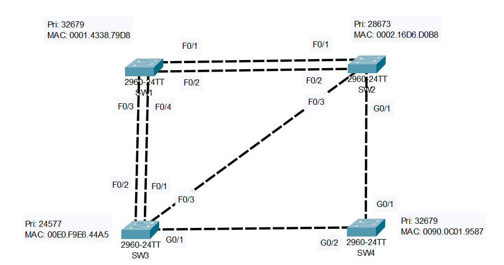

# Analyzing STP

## Introduction

### Packet Tracer

[Download Day 20 Lab - Analyzing STP](../assets/packet-tracer-files/Day%2020%20Lab%20-%20Analyzing%20STP.pkt){:download="Day 20 Lab - Analyzing STP.pkt"}

### Topology

<figure markdown>
  { width="800" }
  <figcaption></figcaption>
</figure>

### Questions

*TURN OFF LINK LIGHTS IN PACKET TRACER FOR THIS LAB*
Options > Preferences > Show Link Lights

1. What switch is the root bridge?
2. Identify the role of each switchport (root/designated/non-designated)

## Answers

??? "1. What switch is the root bridge?"
        
    - Lowest Priority Wins.
    - Tie would go to the lowest MAC address.
    - This means that SW3 is the root bridge. Confirm this by:

    ``` bash
    SW3#show spanning-tree
    VLAN0001
    Spanning tree enabled protocol ieee
    Root ID    Priority    24577
                Address     00E0.F9E6.44A5
                This bridge is the root
                Hello Time  2 sec  Max Age 20 sec  Forward Delay 15 sec

    Bridge ID  Priority    24577  (priority 24576 sys-id-ext 1)
                Address     00E0.F9E6.44A5
                Hello Time  2 sec  Max Age 20 sec  Forward Delay 15 sec
                Aging Time  20

    Interface        Role Sts Cost      Prio.Nbr Type
    ---------------- ---- --- --------- -------- --------------------------------
    Fa0/2            Desg FWD 19        128.2    P2p
    Fa0/3            Desg FWD 19        128.3    P2p
    Fa0/1            Desg FWD 19        128.1    P2p
    Gi0/1            Desg FWD 4         128.25   P2p

    SW3#
    ```
    
??? "2. Identify the role of each switchport (root/designated/non-designated)"

    ??? abstract "Step 1: One Switch is elected as the Root Bridge. All ports on the Root Bridge are Designated Ports."

        Tie Breaker:
             
        - Lowerst Bridge ID
        - Lowest MAC Address

        First, since we know the Root Bridge, we know that all four ports on that switch will be Designated Ports.

        <figure markdown>
            { width="800" }
            <figcaption></figcaption>
        </figure>

    ??? abstract "Step 2: Each remaining switch will select ONE of its interfaces to be its Root Port. Ports across Root Ports are always Designated Ports."

        Tie Breaker:
             
        - Lowest Root Cost
        - Lowest neighbor bridge ID
        - Lowest neighbor port ID

        Next, every other switch needs to have a Root Port. The first criteria to determine the root port is the root cost, that is, the interface with the lowest root cost will become the root port.

        For SW1:
        
        - Via F0/1 or F0/2 it would have a cost of 19, plus 4 for SW2's G0/1, plus 4 for SW4's G0/2, so 27.
        - Via F0/3 or F0/4 it has a cost of just 19. But we don't know which one yet so lets look at the tie breaker - neighbor bridge ID

            - Both of them are connected to the same switch so that's a tie
            - The next tie breaker is the neighbor switch's port ID, the lowest one wins. In this case, F0/4 connects to SW3's F0/1 so F0/4 will become the SW1's Root Port
        
        <figure markdown>
            { width="800" }
            <figcaption></figcaption>
        </figure>

        For SW2:

        - Via G0/1 it would have a cost of 4, plus 4 for SW4's G0/2, so 8. This is the lowest so G0/1 will become the Root Port

        <figure markdown>
            { width="800" }
            <figcaption></figcaption>
        </figure>

        For SW4:

        - Via G0/2 it would have a cost of 4 it will become the Root Port

        <figure markdown>
            { width="800" }
            <figcaption></figcaption>
        </figure>

        Next, any port connected to a Root Port is also Designated. Therefore, SW4's G0/1 port becomes designated.

        <figure markdown>
            { width="800" }
            <figcaption></figcaption>
        </figure>

    ??? abstract "Step 3: Each remaining collision domain will seelct one interface to be a Designated Port. The other port will be Non-Designated."

        Tie Breaker:
             
        - Interface on switch with lowest root cost
        - interface on switch with lowest bridge ID

        Next, in each remaining collision domain, we must determine which side will be Designated and which will be Non-Designated.

        For the collision domain between SW1 and SW3:

        - SW1's F0/1 port is connected to a designated port on the root bridge so it must be non-designated.

        For the collision domain between SW2 and SW3:

        - Same thing so F0/3 becomes non-designated

        <figure markdown>
            { width="800" }
            <figcaption></figcaption>
        </figure>

        Finally, for the remaining collision between SW1 and SW2:
        
        - The interfaces on the switch with the lower root cost will be designated, the other side will be non-designated.

            - SW1's root cost is 19 via F0/4, but SW2's root cost is 8 via G0/1
            - Therefore, both of SW2's F0/1 and F0/2 ports will be designated.

        <figure markdown>
            { width="800" }
            <figcaption></figcaption>
        </figure>


## Commands

* `show spanning-tree {vlan 1}` - show spanning tree summary
  