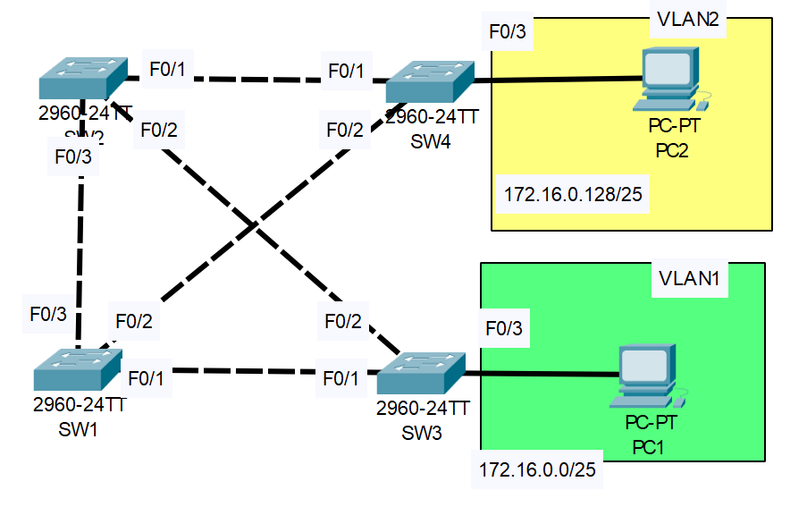

# Configuring Spanning Tree

## Introduction

### Packet Tracer

[Download Day 21 Lab - Configuring Spanning Tree](/JITL/Day%2021%20Lab%20-%20Configuring%20Spanning%20Tree.pkt){:download="Day 21 Lab - Configuring Spanning Tree"}

### Topology

<figure markdown>
  { width="800" }
  <figcaption></figcaption>
</figure>

### Questions

1. Use the CLI to check the current STP topology.  What is the current root bridge? What is the STP role/state of each port on each switch?
2. Configure SW1 as the primary root for VLAN1 and the secondary root for VLAN2. Configure SW2 and the primary root for VLAN2 and the secondary root for VLAN1. What is the STP role/state of each port on each switch now?
3. Increase the VLAN1 cost of SW4's F0/2 interface to 100. Does SW4 select a different root port?  Why/why not?
4. Increase the VLAN1 port priority of SW1's F0/1 to 240. Does SW3 select a different root port?  Why/why not?
5. Configure PortFast and BPDU Guard on the F0/3 interfaces of SW3/SW4.

## Answers

??? "1. Use the CLI to check the current STP topology.  What is the current root bridge? What is the STP role/state of each port on each switch?"

    * `show spanning-tree`

        <figure markdown>
            { width="800" }
            <figcaption></figcaption>
        </figure>

??? "2. Configure SW1 as the primary root for VLAN1 and the secondary root for VLAN2. Configure SW2 and the primary root for VLAN2 and the secondary root for VLAN1. What is the STP role/state of each port on each switch now?"

    === "SW1"

        ``` bash
        SW1(config)#spanning-tree vlan 1 root primary
        SW1(config)#spanning-tree vlan 2 root secondary
        ```

    === "SW2"

        ``` bash
        SW2(config)#spanning-tree vlan 1 root secondary
        SW2(config)#spanning-tree vlan 2 root primary
        ```
    

??? "3. Increase the VLAN1 cost of SW4's F0/2 interface to 100. Does SW4 select a different root port?  Why/why not?"

    Increase the VLAN1 cost to 100
    ``` bash
    SW4#conf t
    SW4(config)#int f0/2
    SW4(config-if)#spanning-tree vlan 1 cost 100
    SW4(config)#end
    SW4#sh span vlan 1

    VLAN0001
    Spanning tree enabled protocol ieee
    Root ID    Priority    24577
                Address     0060.2F90.D14A
                Cost        38
                Port        1(FastEthernet0/1)
                Hello Time  2 sec  Max Age 20 sec  Forward Delay 15 sec

    Bridge ID  Priority    32769  (priority 32768 sys-id-ext 1)
                Address     0090.0C03.2D70
                Hello Time  2 sec  Max Age 20 sec  Forward Delay 15 sec
                Aging Time  20

    Interface        Role Sts Cost      Prio.Nbr Type
    ---------------- ---- --- --------- -------- --------------------------------
    Fa0/1            Root LRN 19        128.1    P2p
    Fa0/2            Altn BLK 100       128.2    P2p
    ```

    ??? abstract "Does SW4 select a different root port?  Why/why not?"

        Yes, because now F0/1 has the lowest cost

??? "4. Increase the VLAN1 port priority of SW1's F0/1 to 240. Does SW3 select a different root port?  Why/why not?"

    Increase the port priority
    ``` bash
    SW1>en
    SW1#conf t
    Enter configuration commands, one per line.  End with CNTL/Z.
    SW1(config)#int f0/1
    SW1(config-if)#spanning-tree vlan 1 port-priority 240
    ```

    ??? abstract "Does SW3 select a different root port?  Why/why not?"

        No

??? "5. Configure PortFast and BPDU Guard on the F0/3 interfaces of SW3/SW4."

    ``` bash
    SW4#conf t
    Enter configuration commands, one per line.  End with CNTL/Z.
    SW4(config)#int f0/3
    SW4(config-if)#spanning-tree portfast
    %Warning: portfast should only be enabled on ports connected to a single
    host. Connecting hubs, concentrators, switches, bridges, etc... to this
    interface  when portfast is enabled, can cause temporary bridging loops.
    Use with CAUTION

    %Portfast has been configured on FastEthernet0/3 but will only
    have effect when the interface is in a non-trunking mode.

    SW4(config-if)#spanning-tree bpduguard enable
    ```

    The port will shutdown if it recieves a BPDU on it


## Commands

* `spanning-tree vlan 1 root primary`
* `spanning-tree vlan 2 root secondary`
* `spanning-tree vlan 1 cost 100`
* `spanning-tree vlan 1 port-priority 240`
* `spanning-tree portfast`
* `spanning-tree bpduguard enable`


  