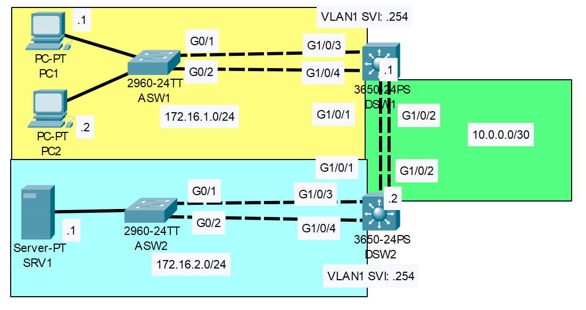

# EtherChannel

## Introduction

### Packet Tracer

[Download Day 23 Lab - EtherChannel](/JITL/Day%2023%20Lab%20-%20EtherChannel.pkt){:download="Day 23 Lab - EtherChannel}

### Topology

<figure markdown>
  { width="800" }
  <figcaption></figcaption>
</figure>

### Questions

*End host and SVI IP addresses are pre-configured*

1. Configure Layer 2 EtherChannel between ASW1 and DSW1 using LACP. Configure it as a trunk.
2. Configure Layer 2 EtherChannel between ASW2 and DSW2 using PAgP. Configure it as a trunk.
3. Configure Layer 3 EtherChannel between DSW1 and DSW2 using static EtherChannel.
4. Configure routes to allow the PCs to reach SRV1.
5. What is the default EtherChannel load-balancing method used on each switch?
6. Configure the switches to load-balance based on source and destination IP addresses.

## Answers

??? "1. Configure Layer 2 EtherChannel between ASW1 and DSW1 using LACP. Configure it as a trunk."

    === "ASW1"

        ``` bash
        ASW1>en
        ASW1#conf t

        ! Assigning G0/1 and G0/2 to EtherChannel 1 and LACP active
        ASW1(config)#int range g0/1-2
        ASW1(config-if-range)#channel-group 1 mode active
        ASW1(config-if-range)#

        Creating a port-channel interface Port-channel 1

        %LINEPROTO-5-UPDOWN: Line protocol on Interface GigabitEthernet0/1, changed state to down

        %LINEPROTO-5-UPDOWN: Line protocol on Interface GigabitEthernet0/1, changed state to up

        %LINEPROTO-5-UPDOWN: Line protocol on Interface GigabitEthernet0/2, changed state to down

        %LINEPROTO-5-UPDOWN: Line protocol on Interface GigabitEthernet0/2, changed state to up

        ! Making it a trunk
        ASW1(config-if-range)#int po1
        ASW1(config-if)#switchport mode trunk
        ```

        ??? abstract "Confirm"

            First we'll check the running-config to see if they're there.

            ``` bash
            ASW1(config-if)#do sh run
            Building configuration...

            Current configuration : 1231 bytes
            !
            version 12.2
            no service timestamps log datetime msec
            no service timestamps debug datetime msec
            no service password-encryption
            !
            hostname ASW1
            !
            !
            ! Omitted
            !
            !
            !
            spanning-tree extend system-id
            !
            interface Port-channel1
            switchport mode trunk
            !
            !
            !
            ! Omitted
            !
            !
            !
            interface FastEthernet0/24
            !
            interface GigabitEthernet0/1
            switchport mode trunk
            channel-group 1 mode active
            !
            interface GigabitEthernet0/2
            switchport mode trunk
            channel-group 1 mode active
            !
            interface Vlan1
            no ip address
            shutdown
            !
            !
            !
            ! Omitted
            !
            !
            !
            end


            ASW1(config-if)#
            ```

            We can also check the status of the etherchannel. The port-channel interface is SD meaning Layer 2 and Down.
            The individual port status is I (stand-alone) meaning that because somethings wrong with the port-channel, they are acting as standalone interfaces.

            ``` bash
            ASW1#show etherchannel summary 

            Flags:  D - down        P - in port-channel
                    I - stand-alone s - suspended
                    H - Hot-standby (LACP only)
                    R - Layer3      S - Layer2
                    U - in use      f - failed to allocate aggregator
                    u - unsuitable for bundling
                    w - waiting to be aggregated
                    d - default port


            Number of channel-groups in use: 1
            Number of aggregators:           1

            Group  Port-channel  Protocol    Ports
            ------+-------------+-----------+----------------------------------------------

            1      Po1(SD)           LACP   Gig0/1(I) Gig0/2(I) 
            ASW1#
            ```

    === "DSW1"

        ``` bash
        DSW1>en
        DSW1#conf t

        DSW1(config)#int range g1/0/3-4
        DSW1(config-if-range)#channel-group 1 mode active
        DSW1(config-if-range)#
        Creating a port-channel interface Port-channel 1

        %LINEPROTO-5-UPDOWN: Line protocol on Interface GigabitEthernet1/0/3, changed state to down

        %LINEPROTO-5-UPDOWN: Line protocol on Interface GigabitEthernet1/0/3, changed state to up

        %LINEPROTO-5-UPDOWN: Line protocol on Interface GigabitEthernet1/0/4, changed state to down

        %LINEPROTO-5-UPDOWN: Line protocol on Interface GigabitEthernet1/0/4, changed state to up

        %LINK-5-CHANGED: Interface Port-channel1, changed state to up

        %LINEPROTO-5-UPDOWN: Line protocol on Interface Port-channel1, changed state to up

        DSW1(config-if-range)#int po1
        ! If the switch supports both ieee and isl then we may have to set the encapsulation type first. You'll get a warning message though if you do mode trunk.
        DSW1(config-if-range)#switchport trunk encapsulation dot1q
        DSW1(config-if)#switchport mode trunk
        DSW1(config-if)#
        ```

        ??? abstract "Confirm"

            We can  check the status of the etherchannel. The port-channel interface is SU meaning Layer 2 and Up.

            ``` bash
            DSW1(config-if)#do sh ether sum
            Flags:  D - down        P - in port-channel
                    I - stand-alone s - suspended
                    H - Hot-standby (LACP only)
                    R - Layer3      S - Layer2
                    U - in use      f - failed to allocate aggregator
                    u - unsuitable for bundling
                    w - waiting to be aggregated
                    d - default port


            Number of channel-groups in use: 1
            Number of aggregators:           1

            Group  Port-channel  Protocol    Ports
            ------+-------------+-----------+----------------------------------------------

            1      Po1(SU)           LACP   Gig1/0/3(P) Gig1/0/4(P) 
            DSW1(config-if)#
            ```

            We can also check the trunk interfaces

            ``` bash
            DSW1#show int trunk
            Port        Mode         Encapsulation  Status        Native vlan
            Po1         on           802.1q         trunking      1

            Port        Vlans allowed on trunk
            Po1         1-1005

            Port        Vlans allowed and active in management domain
            Po1         1

            Port        Vlans in spanning tree forwarding state and not pruned
            Po1         1

            DSW1#
            ```

??? "2. Configure Layer 2 EtherChannel between ASW2 and DSW2 using PAgP. Configure it as a trunk."

    === "ASW2"

        ``` bash
        ASW2>en
        ASW2#conf t
        Enter configuration commands, one per line.  End with CNTL/Z.
        ASW2(config)#int range g0/1-2
        ASW2(config-if-range)#channel-group 1 mode desirable 
        ASW2(config-if-range)#
        Creating a port-channel interface Port-channel 1

        %LINEPROTO-5-UPDOWN: Line protocol on Interface GigabitEthernet0/1, changed state to down

        %LINEPROTO-5-UPDOWN: Line protocol on Interface GigabitEthernet0/1, changed state to up

        %LINEPROTO-5-UPDOWN: Line protocol on Interface GigabitEthernet0/2, changed state to down

        %LINEPROTO-5-UPDOWN: Line protocol on Interface GigabitEthernet0/2, changed state to up

        ASW2(config-if-range)#int po1
        ASW2(config-if)#switchport mode trunk
        ASW2(config-if)#
        ```

    === "DSW2"

        ``` bash
        DSW2>en
        DSW2#conf t
        Enter configuration commands, one per line.  End with CNTL/Z.
        DSW2(config)#int range g1/0/3-4
        DSW2(config-if-range)#channel-group 1 mode desirable
        DSW2(config-if-range)#
        Creating a port-channel interface Port-channel 1

        %LINEPROTO-5-UPDOWN: Line protocol on Interface GigabitEthernet1/0/3, changed state to down

        %LINEPROTO-5-UPDOWN: Line protocol on Interface GigabitEthernet1/0/3, changed state to up

        %LINEPROTO-5-UPDOWN: Line protocol on Interface GigabitEthernet1/0/4, changed state to down

        %LINEPROTO-5-UPDOWN: Line protocol on Interface GigabitEthernet1/0/4, changed state to up

        %LINK-5-CHANGED: Interface Port-channel1, changed state to up

        %LINEPROTO-5-UPDOWN: Line protocol on Interface Port-channel1, changed state to up

        DSW2(config-if-range)#int po1
        DSW2(config-if)#switchport mode trunk
        DSW2(config-if)#
        ```

??? "3. Configure Layer 3 EtherChannel between DSW1 and DSW2 using static EtherChannel."

    === "DSW1"

        ``` bash
        DSW1>en
        DSW1#conf t
        Enter configuration commands, one per line.  End with CNTL/Z.
        DSW1(config)#int range g1/0/1-2
        DSW1(config-if-range)#no switch

        DSW1(config-if-range)#channel-group 2 mode on

        DSW1(config-if-range)#int po2
        DSW1(config-if)#ip add 10.0.0.1 255.255.255.252

        ```


    === "DSW2"

        ``` bash
        DSW2>en
        DSW2#conf t
        Enter configuration commands, one per line.  End with CNTL/Z.
        DSW2(config)#int range g1/0/1-2
        DSW2(config-if-range)#no switch

        DSW2(config-if-range)#channel-group 2 mode on

        DSW2(config-if-range)#int po2
        DSW2(config-if)#ip add 10.0.0.2 255.255.255.252

        ```


??? "4. Configure routes to allow the PCs to reach SRV1."

    === "DSW1"

        ``` bash
        DSW1#conf t
        Enter configuration commands, one per line.  End with CNTL/Z.
        DSW1(config)#ip routing
        DSW1(config)#ip route 172.16.2.0 255.255.255.0 10.0.0.2
        DSW1(config)#
        ```

        ??? abstract "Confirm"

            ``` bash
            DSW1(config)#do show ip route
            Codes: C - connected, S - static, I - IGRP, R - RIP, M - mobile, B - BGP
                D - EIGRP, EX - EIGRP external, O - OSPF, IA - OSPF inter area
                N1 - OSPF NSSA external type 1, N2 - OSPF NSSA external type 2
                E1 - OSPF external type 1, E2 - OSPF external type 2, E - EGP
                i - IS-IS, L1 - IS-IS level-1, L2 - IS-IS level-2, ia - IS-IS inter area
                * - candidate default, U - per-user static route, o - ODR
                P - periodic downloaded static route

            Gateway of last resort is not set

                10.0.0.0/30 is subnetted, 1 subnets
            C       10.0.0.0 is directly connected, Port-channel2
                172.16.0.0/24 is subnetted, 2 subnets
            C       172.16.1.0 is directly connected, Vlan1
            S       172.16.2.0 [1/0] via 10.0.0.2

            DSW1(config)#
            ```

    === "DSW2"

        ``` bash
        DSW2>en
        DSW2#conf t
        Enter configuration commands, one per line.  End with CNTL/Z.
        DSW2(config)#ip routing
        DSW2(config)#ip route 172.16.1.0 255.255.255.0 10.0.0.1
        DSW2(config)#
        ```

        ??? abstract "Confirm"

            ``` bash
            DSW2#show ip route
            Codes: C - connected, S - static, I - IGRP, R - RIP, M - mobile, B - BGP
                D - EIGRP, EX - EIGRP external, O - OSPF, IA - OSPF inter area
                N1 - OSPF NSSA external type 1, N2 - OSPF NSSA external type 2
                E1 - OSPF external type 1, E2 - OSPF external type 2, E - EGP
                i - IS-IS, L1 - IS-IS level-1, L2 - IS-IS level-2, ia - IS-IS inter area
                * - candidate default, U - per-user static route, o - ODR
                P - periodic downloaded static route

            Gateway of last resort is not set

                10.0.0.0/30 is subnetted, 1 subnets
            C       10.0.0.0 is directly connected, Port-channel2
                172.16.0.0/24 is subnetted, 2 subnets
            S       172.16.1.0 [1/0] via 10.0.0.1
            C       172.16.2.0 is directly connected, Vlan1

            DSW2#
            ```

??? "5. What is the default EtherChannel load-balancing method used on each switch?"

    ``` bash
    DSW1#show etherchannel load-balance 
    ```

??? "6. Configure the switches to load-balance based on source and destination IP addresses."

    ``` bash
    DSW1#conf t
    Enter configuration commands, one per line.  End with CNTL/Z.

    DSW1(config)#port-channel load-balance ?

    dst-ip       Dst IP Addr
    dst-mac      Dst Mac Addr
    src-dst-ip   Src XOR Dst IP Addr
    src-dst-mac  Src XOR Dst Mac Addr
    src-ip       Src IP Addr
    src-mac      Src Mac Addr

    DSW1(config)#port-channel load-balance src-dst-ip
    DSW1(config)#
    ```


## Commands

* `spanning-tree portfast `
* `spanning-tree link-type point-to-point `

  