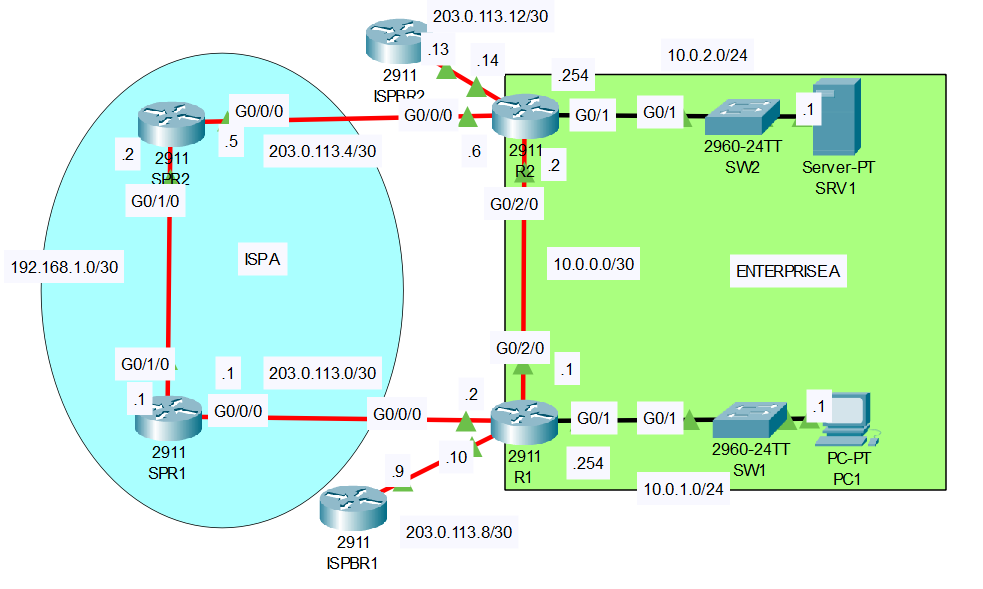

# Floating Static Routes

## Introduction

### Packet Tracer

[Download Day 24 Lab - Floating Static Routes](../assets/packet-tracer-files/Day%2024%20Lab%20-%20Floating%20Static%20Routes.pkt){:download="Day 24 Lab - Floating Static Routes.pkt"}

### Topology

<figure markdown>
  { width="800" }
  <figcaption></figcaption>
</figure>

### Questions

1. Check the routing tables of R1 and R2.  Which dynamic routing protocol is Enterprise A using?
    Which route will be used if PC1 tries to access SRV1?
    Which route will be used if PC1 tries to access remote server 1.1.1.1 over the Internet?
    Test by pinging SRV1 and 1.1.1.1

2. Configure floating static routes on R1 and R2 that allow PC1 to reach SRV1 if the link between R1 and R2 fails.
    Do the routes enter the routing tables of R1 and R2?

3. Shut down the G0/2/0 interface of R1 or R2.
    Do the floating static routes enter the routing tables of R1 and R2?
    Ping from PC1 to SRV1 to confirm.

## Answers

??? "1. Check the routing tables of R1 and R2.  Which dynamic routing protocol is Enterprise A using?"

    OSFP, IA - OSPF inter area

    === "R1"


        ``` bash
        R1#show ip route
        Codes: L - local, C - connected, S - static, R - RIP, M - mobile, B - BGP
            D - EIGRP, EX - EIGRP external, O - OSPF, IA - OSPF inter area
            N1 - OSPF NSSA external type 1, N2 - OSPF NSSA external type 2
            E1 - OSPF external type 1, E2 - OSPF external type 2, E - EGP
            i - IS-IS, L1 - IS-IS level-1, L2 - IS-IS level-2, ia - IS-IS inter area
            * - candidate default, U - per-user static route, o - ODR
            P - periodic downloaded static route

        Gateway of last resort is 203.0.113.9 to network 0.0.0.0

            10.0.0.0/8 is variably subnetted, 5 subnets, 3 masks
        C       10.0.0.0/30 is directly connected, GigabitEthernet0/2/0
        L       10.0.0.1/32 is directly connected, GigabitEthernet0/2/0
        C       10.0.1.0/24 is directly connected, GigabitEthernet0/1
        L       10.0.1.254/32 is directly connected, GigabitEthernet0/1
        O       10.0.2.0/24 [110/2] via 10.0.0.2, 01:09:23, GigabitEthernet0/2/0
            203.0.113.0/24 is variably subnetted, 4 subnets, 2 masks
        C       203.0.113.0/30 is directly connected, GigabitEthernet0/0/0
        L       203.0.113.2/32 is directly connected, GigabitEthernet0/0/0
        C       203.0.113.8/30 is directly connected, GigabitEthernet0/1/0
        L       203.0.113.10/32 is directly connected, GigabitEthernet0/1/0
        S*   0.0.0.0/0 [1/0] via 203.0.113.9

        R1#
        ```

    === "R2"

        ``` bash
        R2#show ip route
        Codes: L - local, C - connected, S - static, R - RIP, M - mobile, B - BGP
            D - EIGRP, EX - EIGRP external, O - OSPF, IA - OSPF inter area
            N1 - OSPF NSSA external type 1, N2 - OSPF NSSA external type 2
            E1 - OSPF external type 1, E2 - OSPF external type 2, E - EGP
            i - IS-IS, L1 - IS-IS level-1, L2 - IS-IS level-2, ia - IS-IS inter area
            * - candidate default, U - per-user static route, o - ODR
            P - periodic downloaded static route

        Gateway of last resort is 203.0.113.13 to network 0.0.0.0

            10.0.0.0/8 is variably subnetted, 5 subnets, 3 masks
        C       10.0.0.0/30 is directly connected, GigabitEthernet0/2/0
        L       10.0.0.2/32 is directly connected, GigabitEthernet0/2/0
        O       10.0.1.0/24 [110/2] via 10.0.0.1, 01:10:52, GigabitEthernet0/2/0
        C       10.0.2.0/24 is directly connected, GigabitEthernet0/1
        L       10.0.2.254/32 is directly connected, GigabitEthernet0/1
            203.0.113.0/24 is variably subnetted, 4 subnets, 2 masks
        C       203.0.113.4/30 is directly connected, GigabitEthernet0/0/0
        L       203.0.113.6/32 is directly connected, GigabitEthernet0/0/0
        C       203.0.113.12/30 is directly connected, GigabitEthernet0/1/0
        L       203.0.113.14/32 is directly connected, GigabitEthernet0/1/0
        S*   0.0.0.0/0 [1/0] via 203.0.113.13

        R2#
        ```

    ??? abstract "Which route will be used if PC1 tries to access SRV1?"

        From R1 to R2

    ??? abstract "Which route will be used if PC1 tries to access remote server 1.1.1.1 over the Internet?"

        From R1 to ISPBR1

??? "2. Configure floating static routes on R1 and R2 that allow PC1 to reach SRV1 if the link between R1 and R2 fails."

    === "R1"

        ``` bash
        R1#conf t
        Enter configuration commands, one per line.  End with CNTL/Z.
        R1(config)#ip route 10.0.2.0 255.255.255.0 203.0.113.1 111
        R1(config)#
        ```

        ??? abstract "Does the route enter the routing table of R1?"

            No

            ``` bash
            R1#
            %SYS-5-CONFIG_I: Configured from console by console
            show ip route
            Codes: L - local, C - connected, S - static, R - RIP, M - mobile, B - BGP
                D - EIGRP, EX - EIGRP external, O - OSPF, IA - OSPF inter area
                N1 - OSPF NSSA external type 1, N2 - OSPF NSSA external type 2
                E1 - OSPF external type 1, E2 - OSPF external type 2, E - EGP
                i - IS-IS, L1 - IS-IS level-1, L2 - IS-IS level-2, ia - IS-IS inter area
                * - candidate default, U - per-user static route, o - ODR
                P - periodic downloaded static route

            Gateway of last resort is 203.0.113.9 to network 0.0.0.0

                10.0.0.0/8 is variably subnetted, 5 subnets, 3 masks
            C       10.0.0.0/30 is directly connected, GigabitEthernet0/2/0
            L       10.0.0.1/32 is directly connected, GigabitEthernet0/2/0
            C       10.0.1.0/24 is directly connected, GigabitEthernet0/1
            L       10.0.1.254/32 is directly connected, GigabitEthernet0/1
            O       10.0.2.0/24 [110/2] via 10.0.0.2, 01:24:16, GigabitEthernet0/2/0
                203.0.113.0/24 is variably subnetted, 4 subnets, 2 masks
            C       203.0.113.0/30 is directly connected, GigabitEthernet0/0/0
            L       203.0.113.2/32 is directly connected, GigabitEthernet0/0/0
            C       203.0.113.8/30 is directly connected, GigabitEthernet0/1/0
            L       203.0.113.10/32 is directly connected, GigabitEthernet0/1/0
            S*   0.0.0.0/0 [1/0] via 203.0.113.9

            R1#
            ```

    === "R2"

        ``` bash
        R2#conf t
        Enter configuration commands, one per line.  End with CNTL/Z.
        R2(config)#ip route 10.0.1.0 255.255.255.0 203.0.113.5 111
        R2(config)#
        ```

        ??? abstract "Does the route enter the routing table of R1?"

            No

            ``` bash
            R2#show ip route
            Codes: L - local, C - connected, S - static, R - RIP, M - mobile, B - BGP
                D - EIGRP, EX - EIGRP external, O - OSPF, IA - OSPF inter area
                N1 - OSPF NSSA external type 1, N2 - OSPF NSSA external type 2
                E1 - OSPF external type 1, E2 - OSPF external type 2, E - EGP
                i - IS-IS, L1 - IS-IS level-1, L2 - IS-IS level-2, ia - IS-IS inter area
                * - candidate default, U - per-user static route, o - ODR
                P - periodic downloaded static route

            Gateway of last resort is 203.0.113.13 to network 0.0.0.0

                10.0.0.0/8 is variably subnetted, 5 subnets, 3 masks
            C       10.0.0.0/30 is directly connected, GigabitEthernet0/2/0
            L       10.0.0.2/32 is directly connected, GigabitEthernet0/2/0
            O       10.0.1.0/24 [110/2] via 10.0.0.1, 01:24:47, GigabitEthernet0/2/0
            C       10.0.2.0/24 is directly connected, GigabitEthernet0/1
            L       10.0.2.254/32 is directly connected, GigabitEthernet0/1
                203.0.113.0/24 is variably subnetted, 4 subnets, 2 masks
            C       203.0.113.4/30 is directly connected, GigabitEthernet0/0/0
            L       203.0.113.6/32 is directly connected, GigabitEthernet0/0/0
            C       203.0.113.12/30 is directly connected, GigabitEthernet0/1/0
            L       203.0.113.14/32 is directly connected, GigabitEthernet0/1/0
            S*   0.0.0.0/0 [1/0] via 203.0.113.13

            R2#
            ```
??? "3. Shut down the G0/2/0 interface of R1 or R2."

    === "R1"

        ``` bash
        R1#
        R1#conf t
        Enter configuration commands, one per line.  End with CNTL/Z.
        R1(config)#int g0/2/0
        R1(config-if)#shut

        R1(config-if)#
        %LINK-5-CHANGED: Interface GigabitEthernet0/2/0, changed state to administratively down

        %LINEPROTO-5-UPDOWN: Line protocol on Interface GigabitEthernet0/2/0, changed state to down

        11:26:34: %OSPF-5-ADJCHG: Process 1, Nbr 203.0.113.14 on GigabitEthernet0/2/0 from FULL to DOWN, Neighbor Down: Interface down or detached

        R1(config-if)#
        ```

        ??? abstract "Do the routes appear now?"

            Yes

            ``` bash
            R1#show ip route
            Codes: L - local, C - connected, S - static, R - RIP, M - mobile, B - BGP
                D - EIGRP, EX - EIGRP external, O - OSPF, IA - OSPF inter area
                N1 - OSPF NSSA external type 1, N2 - OSPF NSSA external type 2
                E1 - OSPF external type 1, E2 - OSPF external type 2, E - EGP
                i - IS-IS, L1 - IS-IS level-1, L2 - IS-IS level-2, ia - IS-IS inter area
                * - candidate default, U - per-user static route, o - ODR
                P - periodic downloaded static route

            Gateway of last resort is 203.0.113.9 to network 0.0.0.0

                10.0.0.0/8 is variably subnetted, 3 subnets, 2 masks
            C       10.0.1.0/24 is directly connected, GigabitEthernet0/1
            L       10.0.1.254/32 is directly connected, GigabitEthernet0/1
            S       10.0.2.0/24 [111/0] via 203.0.113.1
                203.0.113.0/24 is variably subnetted, 4 subnets, 2 masks
            C       203.0.113.0/30 is directly connected, GigabitEthernet0/0/0
            L       203.0.113.2/32 is directly connected, GigabitEthernet0/0/0
            C       203.0.113.8/30 is directly connected, GigabitEthernet0/1/0
            L       203.0.113.10/32 is directly connected, GigabitEthernet0/1/0
            S*   0.0.0.0/0 [1/0] via 203.0.113.9

            R1#
            ```

## Commands

* `spanning-tree portfast `
* `spanning-tree link-type point-to-point `

  