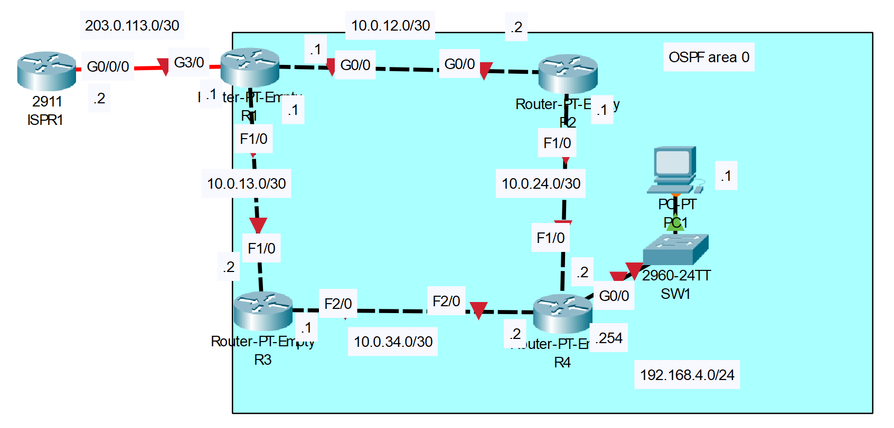

# OSPF (part 1)

## Introduction

### Packet Tracer

[Download Day 26 Lab - OSPF (part 1)](/JITL/Day%2026%20Lab%20-%20OSPF%20(Part%201).pkt){:download="Day 26 Lab - OSPF (part 1)}

### Topology

<figure markdown>
  { width="800" }
  <figcaption></figcaption>
</figure>

### Questions

1. Configure the appropriate hostnames and IP addresses on each device.  Enable router interfaces.
    (You don't have to configure ISPR1)

2. Configure a loopback interface on each router (1.1.1.1/32 for R1, 2.2.2.2/32 for R2, etc.)

3. Configure OSPF on each router.
    Enable OSPF on each interface (including loopback interfaces).
    (Do not enable OSPF on R1's Internet link)
    Configure passive interfaces where appropriate (including loopback interfaces).

4. Configure R1 as an ASBR that advertises a default route in to the OSPF domain.

5. Check the routing tables of R2, R3, and R4.  What default route(s) were added?

## Answers


??? "1. Configure the appropriate hostnames and IP addresses on each device.  Enable router interfaces."

    === "R1"

        ``` bash
        Router>en
        Router#conf t
        Enter configuration commands, one per line.  End with CNTL/Z.
        Router(config)#hostname R1
        R1(config)#int g0/0
        R1(config-if)#ip add 10.0.12.1 255.255.255.252
        R1(config-if)#no shut

        R1(config-if)#
        %LINK-5-CHANGED: Interface GigabitEthernet0/0, changed state to up

        R1(config-if)#int f1/0
        R1(config-if)#ip add 10.0.13.1 255.255.255.252
        R1(config-if)#no shut

        R1(config-if)#int f3/0
        R1(config-if)#ip add 203.0.113.1 255.255.255.252
        R1(config-if)#no shut

        R1(config-if)#
        %LINK-5-CHANGED: Interface FastEthernet1/0, changed state to up

        R1(config-if)#
        ```

    === "R2"

        ``` bash
        Router>en
        Router#conf t
        Enter configuration commands, one per line.  End with CNTL/Z.
        Router(config)#hostname R2
        R2(config)#int g0/0
        R2(config-if)#ip add 10.0.12.2 255.255.255.252
        R2(config-if)#no shut

        R2(config-if)#
        %LINK-5-CHANGED: Interface GigabitEthernet0/0, changed state to up

        %LINEPROTO-5-UPDOWN: Line protocol on Interface GigabitEthernet0/0, changed state to up

        R2(config-if)#int f1/0
        R2(config-if)#ip add 10.0.24.1 255.255.255.252
        R2(config-if)#no shut

        R2(config-if)#
        %LINK-5-CHANGED: Interface FastEthernet1/0, changed state to up

        R2(config-if)#
        ```

    === "R3"

        ``` bash
        Router>en
        Router#conf t
        Enter configuration commands, one per line.  End with CNTL/Z.
        Router(config)#hostname R3
        R3(config)#int f1/0
        R3(config-if)#ip add 10.0.13.2 255.255.255.252
        R3(config-if)#no shut

        R3(config-if)#
        %LINK-5-CHANGED: Interface FastEthernet1/0, changed state to up

        %LINEPROTO-5-UPDOWN: Line protocol on Interface FastEthernet1/0, changed state to up

        R3(config-if)#int f2/0
        R3(config-if)#ip add 10.0.34.1 255.255.255.252
        R3(config-if)#no shut

        R3(config-if)#
        %LINK-5-CHANGED: Interface FastEthernet2/0, changed state to up

        R3(config-if)#
        ```
    
    === "R4"

        ``` bash
        Router>en
        Router#conf t
        Enter configuration commands, one per line.  End with CNTL/Z.
        Router(config)#hostname R4
        R4(config)#int f1/0
        R4(config-if)#ip add 10.0.24.2 255.255.255.252
        R4(config-if)#
        R4(config-if)#no shut

        R4(config-if)#
        %LINK-5-CHANGED: Interface FastEthernet1/0, changed state to up

        %LINEPROTO-5-UPDOWN: Line protocol on Interface FastEthernet1/0, changed state to up

        R4(config-if)#int f2/0
        R4(config-if)#ip add 10.0.34.2 255.255.255.252
        R4(config-if)#no shut

        R4(config-if)#
        %LINK-5-CHANGED: Interface FastEthernet2/0, changed state to up

        %LINEPROTO-5-UPDOWN: Line protocol on Interface FastEthernet2/0, changed state to up

        R4(config-if)#int g0/0
        R4(config-if)#ip add 192.168.4.254 255.255.255.0
        R4(config-if)#no shut

        R4(config-if)#
        %LINK-5-CHANGED: Interface GigabitEthernet0/0, changed state to up

        %LINEPROTO-5-UPDOWN: Line protocol on Interface GigabitEthernet0/0, changed state to up

        R4(config-if)#
        ```

    === "SW1"

        ``` bash
        Switch>en
        Switch#conf t
        Enter configuration commands, one per line.  End with CNTL/Z.
        Switch(config)#hostname SW1
        SW1(config)#
        ```

    === "PC1"

        ``` bash
        Default GW: 192.168.4.254
        IP Add: 192.168.4.1
        Subnet: 255.255.255.0
        ```


??? "2. Configure a loopback interface on each router (1.1.1.1/32 for R1, 2.2.2.2/32 for R2, etc.)"

    === "R1"

        ``` bash
        R1(config-if)#int l0

        R1(config-if)#
        %LINK-5-CHANGED: Interface Loopback0, changed state to up

        %LINEPROTO-5-UPDOWN: Line protocol on Interface Loopback0, changed state to up

        R1(config-if)#ip add 1.1.1.1 255.255.255.255
        R1(config-if)#
        ```

    === "R2"

        ``` bash
        R2(config-if)#int l0

        R2(config-if)#
        %LINK-5-CHANGED: Interface Loopback0, changed state to up

        %LINEPROTO-5-UPDOWN: Line protocol on Interface Loopback0, changed state to up

        R2(config-if)#ip add 2.2.2.2 255.255.255.255
        R2(config-if)#
        ```

    === "R3"

        ``` bash
        R3(config-if)#int l0

        R3(config-if)#
        %LINK-5-CHANGED: Interface Loopback0, changed state to up

        %LINEPROTO-5-UPDOWN: Line protocol on Interface Loopback0, changed state to up

        R3(config-if)#ip add 3.3.3.3 255.255.255.255
        R3(config-if)#
        ```

    === "R4"

        ``` bash
        R4(config-if)#int l0

        R4(config-if)#
        %LINK-5-CHANGED: Interface Loopback0, changed state to up

        %LINEPROTO-5-UPDOWN: Line protocol on Interface Loopback0, changed state to up

        R4(config-if)#ip add 4.4.4.4 255.255.255.255
        R4(config-if)#
        ```

??? "3. Configure OSPF on each router."

    === "R1"

        ??? abstract "Enable OSPF on each interface (including loopback interfaces)."

            ``` bash
            R1#conf t
            Enter configuration commands, one per line.  End with CNTL/Z.
            R1(config)#router ospf 1
            R1(config-router)#

            ! Enabling interfaces by network address
            R1(config-router)#network 10.0.12.0 0.0.0.3 area 0
            R1(config-router)#network 10.0.13.0 0.0.0.3 area 0
            R1(config-router)#network 1.1.1.1 0.0.0.0 area 0
            R1(config-router)#
            ```

        ??? abstract "Configure passive interfaces where appropriate (including loopback interfaces)."

            ``` bash
            R1(config-router)#passive-interface l0
            ```

    === "R2"

        ??? abstract "Enable OSPF on each interface (including loopback interfaces)."

            ``` bash
            R2#conf t
            Enter configuration commands, one per line.  End with CNTL/Z.
            R2(config)#router ospf 1

            ! Enabling OSPF on both interfaces at the same time
            R2(config-router)#net 10.0.0.0 0.0.255.255 area 0
            R2(config-router)#net 2.2.2.2 0.0.0.0 area 0
            ```

        ??? abstract "Configure passive interfaces where appropriate (including loopback interfaces)."

            ``` bash
            R2(config-router)#passive-interface l0
            ```

    === "R3"

        ??? abstract "Enable OSPF on each interface (including loopback interfaces)."

            ``` bash
            R3#conf t
            Enter configuration commands, one per line.  End with CNTL/Z.
            R3(config)#router ospf 1
            R3(config-router)#

            ! Enabling OSPF by exact address
            R3(config-router)#net 10.0.13.2 0.0.0.0 area 0
            R3(config-router)#net 10.0.34.1 0.0.0.0 area 0
            R3(config-router)#net 3.3.3.3 0.0.0.0 area 0
            ```

        ??? abstract "Configure passive interfaces where appropriate (including loopback interfaces)."

            ``` bash
            R3(config-router)#passive-interface l0
            ```

    === "R4"

        ??? abstract "Enable OSPF on each interface (including loopback interfaces)."

            ``` bash
            R4#conf t
            Enter configuration commands, one per line.  End with CNTL/Z.
            R4(config)#router ospf 1

            ! Enabling OSPF on all interfaces
            R4(config-router)#network 0.0.0.0 255.255.255.255 area 0
            ```

        ??? abstract "Configure passive interfaces where appropriate (including loopback interfaces)."

            ``` bash
            R4(config-router)#passive-interface l0
            R4(config-router)#passive-interface g0/0
            ```

??? "4. Configure R1 as an ASBR that advertises a default route in to the OSPF domain."

    === "R1"

        ``` bash
        R1(config-router)#default-information originate
        R1(config-router)#end
        R1#
        %SYS-5-CONFIG_I: Configured from console by console

        R1#conf t
        Enter configuration commands, one per line.  End with CNTL/Z.
        R1(config)#ip route 0.0.0.0 0.0.0.0 203.0.113.2
        R1(config)#
        ```

        ??? abstract "Confirm"

            ``` bash
            R1(config)#do show ip prot

            Routing Protocol is "ospf 1"
            Outgoing update filter list for all interfaces is not set 
            Incoming update filter list for all interfaces is not set 
            Router ID 1.1.1.1
            It is an autonomous system boundary router
            Redistributing External Routes from,
            Number of areas in this router is 1. 1 normal 0 stub 0 nssa
            Maximum path: 4
            Routing for Networks:
                10.0.12.0 0.0.0.3 area 0
                10.0.13.0 0.0.0.3 area 0
                1.1.1.1 0.0.0.0 area 0
            Passive Interface(s): 
                Loopback0
            Routing Information Sources:  
                Gateway         Distance      Last Update 
                1.1.1.1              110      00:27:09
                2.2.2.2              110      00:28:49
                3.3.3.3              110      00:01:01
                4.4.4.4              110      00:29:21
            Distance: (default is 110)

            R1(config)#
            ```

## Commands

* `spanning-tree portfast `
* `spanning-tree link-type point-to-point `

  