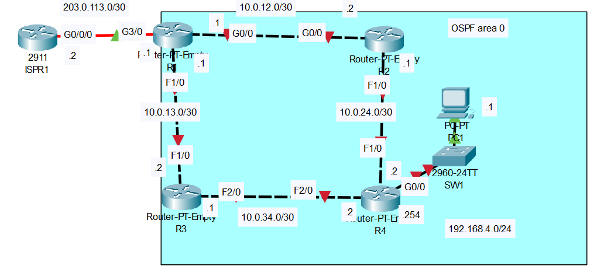

# OSPF (part 2)

## Introduction

### Packet Tracer

[Download Day 27 Lab - OSPF (part 2)](../assets/packet-tracer-files/Day%2027%20Lab%20-%20OSPF%20(Part%202).pkt){:download="Day 27 Lab - OSPF (part 2).pkt"}

### Topology

<figure markdown>
  { width="800" }
  <figcaption></figcaption>
</figure>

### Questions

1. Configure the appropriate hostnames and IP addresses on each device.  Enable router interfaces.
    (You don't have to configure ISPR1)

2. Configure a loopback interface on each router (1.1.1.1/32 for R1, 2.2.2.2/32 for R2, etc.)

3. Enable OSPF directly on each interface of the routers.
    Configure passive interfaces as appropriate.
 
4. Configure the reference bandwidth on each router so a FastEthernet interface has a cost of 100.

5. Configure R1 as an ASBR that advertises a default route in to the OSPF domain.

6. Check the routing tables of R4.  What default route(s) were added?
    (watch the video for a brief explanation)

7. Use Simulation mode to view the OSPF Hello messages being sent by the routers.
    What fields are included in the Hello message?

## Answers


??? "1. Configure the appropriate hostnames and IP addresses on each device.  Enable router interfaces. Loopback. Passive. R1 Originate"

    === "R1"

        ``` bash
        Router>en
        Router#conf t
        Enter configuration commands, one per line.  End with CNTL/Z.

        Router(config)#hostname R1
        R1(config)#int g0/0
        R1(config-if)#ip add 10.0.12.1 255.255.255.252
        R1(config-if)#no shut
        R1(config-if)#int f1/0
        R1(config-if)#ip add 10.0.13.1 255.255.255.252
        R1(config-if)#no shut
        R1(config-if)#int g3/0
        R1(config-if)#ip add 203.0.113.1 255.255.255.252
        R1(config-if)#no shut
        R1(config-if)#int l0
        R1(config-if)#ip add 1.1.1.1 255.255.255.255
        R1(config-if)#exit

        R1(config)#
        R1(config)#router ospf 1
        R1(config-router)#net 10.0.12.1 0.0.0.3 area 0
        R1(config-router)#net 10.0.13.1 0.0.0.3 area 0
        R1(config-router)#net 1.1.1.1 0.0.0.0 area 0

        R1(config-router)#passive-interface l0

        R1(config-router)#default-information originate
        R1(config-router)#exit
        R1(config)#ip route 0.0.0.0 0.0.0.0 203.0.113.2
        R1(config)#end
        R1#
        ```

    === "R2"

        ``` bash
        Router>en
        Router#conf t
        Enter configuration commands, one per line.  End with CNTL/Z.

        Router(config)#hostname R2
        R2(config)#int g0/0
        R2(config-if)#ip add 10.0.12.2 255.255.255.252
        R2(config-if)#no shut
        R2(config)#int f1/0
        R2(config-if)#ip add 10.0.24.1 255.255.255.252
        R2(config-if)#no shut
        R2(config-if)#int l0
        R2(config-if)#ip add 2.2.2.2 255.255.255.255
        R2(config-if)#
        R2(config-if)#exit

        R2(config)#router ospf 2
        R2(config-router)#net 10.0.12.2 0.0.0.0 area 0
        R2(config-router)#net 10.0.24.0 0.0.0.0 area 0
        R2(config-router)#net 2.2.2.2 0.0.0.0 area 0

        R2(config-router)#passive-interface l0
        R2(config-router)#end
        R2#
        ```

    === "R3"

        ``` bash
        Router>en
        Router#conf t
        Enter configuration commands, one per line.  End with CNTL/Z.

        Router(config)#hostname R3
        R3(config)#int F1/0
        R3(config-if)#ip add 10.0.13.2 255.255.255.252
        R3(config-if)#no shut
        R3(config-if)#int f2/0
        R3(config-if)#ip add 10.0.34.1 255.255.255.252
        R3(config-if)#no shut
        R3(config-if)#int l0
        R3(config-if)# ip add 3.3.3.3 255.255.255.255
        R3(config-if)#
        R3(config-if)#exit

        R3(config)#router ospf 3
        R3(config-router)#net 10.0.13.2 0.0.0.0 area 0
        R3(config-router)#net 10.0.34.1 0.0.0.0 area 0
        R3(config-router)#net 3.3.3.3 0.0.0.0 area 0

        R3(config-router)#passive-interface l0
        R3(config-router)#end
        R3#
        ```
    
    === "R4"

        ``` bash
        Router>en
        Router#conf t
        Router(config)#hostname R4

        R4(config)#int f1/0
        R4(config-if)#ip add 10.0.24.2 255.255.255.252
        R4(config-if)#no shut
        R4(config-if)#int f2/0
        R4(config-if)#ip add 10.0.34.2 255.255.255.252
        R4(config-if)#no shut
        R4(config-if)#int g0/0
        R4(config-if)#ip add 192.168.4.254 255.255.255.0
        R4(config-if)#no shut
        R4(config-if)#ip add 4.4.4.4 255.255.255.255
        R4(config-if)#

        R4(config-if)#int range g0/0, f1/0, f2/0, l0
        R4(config-if-range)#ip ospf 1 area 0
        R4(config-if-range)#router ospf 1

        R4(config-router)#passive-interface default
        R4(config-router)#no passive-interface f1/0
        R4(config-router)#no passive-interface f2/0
        R4(config-router)#end
        ```

    === "SW1"

        ``` bash
        Switch>en
        Switch#conf t
        Enter configuration commands, one per line.  End with CNTL/Z.
        Switch(config)#hostname SW1
        SW1(config)#
        ```

    === "PC1"

        ``` bash
        Default GW: 192.168.4.254
        IP Add: 192.168.4.1
        Subnet: 255.255.255.0
        ```

??? "4. Configure the reference bandwidth on each router so a FastEthernet interface has a cost of 100."

    === "R4"

        ``` bash
        R4#conf t
        Enter configuration commands, one per line.  End with CNTL/Z.
        R4(config)#router ospf 1
        R4(config-router)#auto-cost reference-bandwidth 10000
        
        % OSPF: Reference bandwidth is changed.
                Please ensure reference bandwidth is consistent across all routers.
        ```

        ??? abstract "Confirm"

            ``` bash
            R4(config-router)#do show ip ospf int

            GigabitEthernet0/0 is up, line protocol is up
                Internet address is 192.168.4.254/24, Area 0
                Process ID 1, Router ID 4.4.4.4, Network Type BROADCAST, Cost: 10
                Transmit Delay is 1 sec, State WAITING, Priority 1
                No designated router on this network
                No backup designated router on this network
                Timer intervals configured, Hello 10, Dead 40, Wait 40, Retransmit 5
                    No Hellos (Passive interface)
                Index 1/1, flood queue length 0
                Next 0x0(0)/0x0(0)
                Last flood scan length is 1, maximum is 1
                Last flood scan time is 0 msec, maximum is 0 msec
                Neighbor Count is 0, Adjacent neighbor count is 0
                Suppress hello for 0 neighbor(s)
            FastEthernet1/0 is up, line protocol is up
                Internet address is 10.0.24.2/30, Area 0
                Process ID 1, Router ID 4.4.4.4, Network Type BROADCAST, Cost: 100
                Transmit Delay is 1 sec, State DR, Priority 1
                Designated Router (ID) 4.4.4.4, Interface address 10.0.24.2
                No backup designated router on this network
                Timer intervals configured, Hello 10, Dead 40, Wait 40, Retransmit 5
                --More-- 
            ```

## Commands

* `spanning-tree portfast `
* `spanning-tree link-type point-to-point `

  