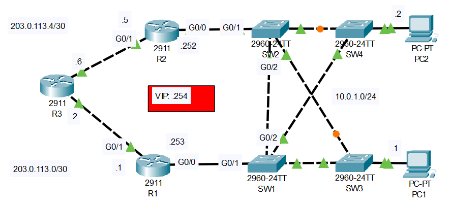

# HSRP Configuration

## Introduction

### Packet Tracer

[Download Day 29 Lab - HSRP Configuration](/jitl/Day%2029%20Lab%20-%20HSRP%20Configuration.pkt){:download="Day 24 Lab - HSRP Configuration}

### Topology

<figure markdown>
  { width="800" }
  <figcaption></figcaption>
</figure>

### Questions

1. Ping external server 8.8.8.8 from PC1/PC2.
    What is the default gateway configured as?

2. Configure HSRPv2 on R1/R2.
    Raise R1's priority above the default, lower R2's priority below the default.
    Enable preemption.

3. Configure the VIP as the default gateway of PC1/PC2.
    Ping 8.8.8.8 from the PCs.  Check the PCs' ARP table.
    What MAC address is mapped to the VIP?

4. Turn off R1 (save the config first!).
    After it restarts, ping from PC1 to 8.8.8.8 again.
    Is R2 used as the default gateway?

5. Turn on R1 again.  
    Does it become the active router again?

## Answers


??? "1. Ping external server 8.8.8.8 from PC1/PC2. What is the default gateway configured as?"

    10.0.1.253


??? "2. Configure HSRPv2 on R1/R2. Raise R1's priority above the default, lower R2's priority below the default. Enable preemption."

    === "R1"

        ``` bash
        R1>en
        R1#conf t
        Enter configuration commands, one per line.  End with CNTL/Z.

        R1(config)#int g0/0
        R1(config-if)#standby version 2

        ! Good practice is to match the standby group with the VLAN number, in this case, 1
        R1(config-if)#standby 1 ip 10.0.1.254
        R1(config-if)#
        %HSRP-6-STATECHANGE: GigabitEthernet0/0 Grp 1 state Init -> Init

        ! Default is 100
        R1(config-if)#standby 1 priority 200
        R1(config-if)#
        %HSRP-6-STATECHANGE: GigabitEthernet0/0 Grp 1 state Speak -> Standby

        %HSRP-6-STATECHANGE: GigabitEthernet0/0 Grp 1 state Standby -> Active
        stand

        ! Enable Preemption
        R1(config-if)#standby 1 preempt 
        R1(config-if)#
        ```

    === "R2"

        ``` bash
        R2>en
        R2#conf t
        Enter configuration commands, one per line.  End with CNTL/Z.

        R2(config)#int g0/0
        R2(config-if)#standby version 2
        R2(config-if)#standby 1 ip 10.0.1.254
        R2(config-if)#
        %HSRP-6-STATECHANGE: GigabitEthernet0/0 Grp 1 state Init -> Init

        R2(config-if)#standby priority 50
        R2(config-if)#
        ```

    ??? abstract "Confirm"

        ``` bash
        R2#show standby 
        GigabitEthernet0/0 - Group 1 (version 2)
        State is Standby
            5 state changes, last state change 00:08:48
        Virtual IP address is 10.0.1.254
        Active virtual MAC address is 0000.0C9F.F001
            Local virtual MAC address is 0000.0C9F.F001 (v2 default)
        Hello time 3 sec, hold time 10 sec
            Next hello sent in 1.58 secs
        Preemption enabled
        Active router is 10.0.1.253
        Standby router is local
        Priority 50 (configured 50)
        Group name is hsrp-Gig0/0-1 (default)
        R2#
        ```
??? "3. Configure the VIP as the default gateway of PC1/PC2. Ping 8.8.8.8 from the PCs.  Check the PCs' ARP table. What MAC address is mapped to the VIP?"

    Ping works. The MAC address is HSRP version 2 virtual MAC.

??? "4. Configure the VIP as the default gateway of PC1/PC2. Ping 8.8.8.8 from the PCs.  Check the PCs' ARP table. What MAC address is mapped to the VIP?"

    Using tracert we can se that it goes to R2.

??? "5. Turn on R1 again. Does it become the active router again?"

    tracert shows that R1 becomes the primary again.

## Commands

* `spanning-tree portfast `
* `spanning-tree link-type point-to-point `

  