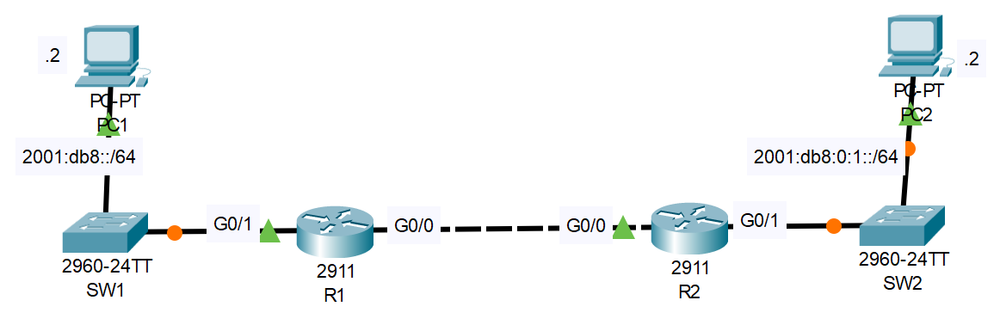

# IPv6 Configuration (Part 2)

## Introduction

### Packet Tracer

[Download Day 32 Lab - IPv6 Configuration (Part 2)](../assets/packet-tracer-files/Day%2032%20Lab%20-%20IPv6%20Configuration%20(Part%202).pkt){:download="Day 32 Lab - IPv6 Configuration (Part 2).pkt"}

### Topology

<figure markdown>
  { width="800" }
  <figcaption></figcaption>
</figure>

### Questions

Interfaces are enabled and configured with IPv4.
You will configure IPv6 in the network.

1. Use EUI-64 to configure IPv6 addresses on G0/1 of R1/R2

2. Configure the appropriate IPv6 addresses/default gateways on PC1 and PC2.

3. Enable IPv6 on G0/0 of R1/R2 without explicitly configuring an IPv6 address.

4. Configure static routes on R1/R2 to enable PC1 to ping PC2. Use the 'ipv6 route' command with '?' to learn how to use the command.

## Answers


??? "1. Use EUI-64 to configure IPv6 addresses on G0/1 of R1/R2"

    === "R1"

        ``` bash
        R1>en
        R1#conf t
        Enter configuration commands, one per line.  End with CNTL/Z.

        R1(config)#ipv6 uni
        R1(config)#ipv6 unicast-routing 

        R1(config)#int g0/1
        R1(config-if)#ipv6 add 2001:db8::/64 eui-64
        ```

        ??? abstract "Confirm"

            ``` bash
            R1(config-if)#do show ipv6 int bri
            GigabitEthernet0/0         [up/up]
                unassigned
            GigabitEthernet0/1         [up/up]
                FE80::230:F2FF:FE36:4502
                2001:DB8::230:F2FF:FE36:4502
            GigabitEthernet0/2         [administratively down/down]
                unassigned
            Vlan1                      [administratively down/down]
                unassigned
            R1(config-if)#
            ```

    === "R2"

        ``` bash
        R2>en
        R2#conf t
        Enter configuration commands, one per line.  End with CNTL/Z.

        R2(config)#ipv6 un
        R2(config)#ipv6 unicast-routing

        R2(config)#int g0/1
        R2(config-if)#ipv6 add 2001:db8:0:1::/64 eui-64
        ```

        ??? abstract "Confirm"

            ``` bash
            R2(config-if)#do show ipv6 int bri
            GigabitEthernet0/0         [up/up]
                unassigned
            GigabitEthernet0/1         [up/up]
                FE80::201:63FF:FEB0:B802
                2001:DB8:0:1:201:63FF:FEB0:B802
            GigabitEthernet0/2         [administratively down/down]
                unassigned
            Vlan1                      [administratively down/down]
                unassigned
            R2(config-if)#
            ```


??? "2. Configure the appropriate IPv6 addresses/default gateways on PC1 and PC2."

    === "PC1"

        ``` bash
        Default GW: 2001:DB8::230:F2FF:FE36:4502
        IP Add: 2001:db8::2
        Subnet: 64
        ```

    === "PC2"

        ``` bash
        Default GW: 2001:DB8:0:1:201:63FF:FEB0:B802
        IP Add: 2001:db8:0:1::2
        Subnet: 64
        ```

??? "3. Enable IPv6 on G0/0 of R1/R2 without explicitly configuring an IPv6 address."

    === "R1"

        ``` bash
        R1(config)#int g0/0
        R1(config-if)#ipv6 enable
        ```

        ??? abstract "Confirm"

            This creates a link-local address on the interface

            ``` bash
            R1(config-if)#do sh ipv6 int bri
            GigabitEthernet0/0         [up/up]
                FE80::230:F2FF:FE36:4501
            GigabitEthernet0/1         [up/up]
                FE80::230:F2FF:FE36:4502
                2001:DB8::230:F2FF:FE36:4502
            GigabitEthernet0/2         [administratively down/down]
                unassigned
            Vlan1                      [administratively down/down]
                unassigned
            R1(config-if)#
            ```

    === "R2"

        ``` bash
        R2(config)#int g0/0
        R2(config-if)#ipv6 enable
        ```

        ??? abstract "Confirm"

            This creates a link-local address on the interface

            ``` bash
            R2(config-if)#do sh ipv6 int bri
            GigabitEthernet0/0         [up/up]
                FE80::201:63FF:FEB0:B801
            GigabitEthernet0/1         [up/up]
                FE80::201:63FF:FEB0:B802
                2001:DB8:0:1:201:63FF:FEB0:B802
            GigabitEthernet0/2         [administratively down/down]
                unassigned
            Vlan1                      [administratively down/down]
                unassigned
            R2(config-if)#
            R2#
            ```

??? "4. Configure static routes on R1/R2 to enable PC1 to ping PC2. Use the 'ipv6 route' command with '?' to learn how to use the command."

    === "R1"

        ``` bash
        R1(config)#ipv6 route 2001:db8:0:1::/64 g0/0 FE80::201:63FF:FEB0:B801
        ```

        ??? abstract "Confirm"

            ``` bash
            R1#show ipv6 route
            IPv6 Routing Table - 4 entries
            Codes: C - Connected, L - Local, S - Static, R - RIP, B - BGP
                U - Per-user Static route, M - MIPv6
                I1 - ISIS L1, I2 - ISIS L2, IA - ISIS interarea, IS - ISIS summary
                ND - ND Default, NDp - ND Prefix, DCE - Destination, NDr - Redirect
                O - OSPF intra, OI - OSPF inter, OE1 - OSPF ext 1, OE2 - OSPF ext 2
                ON1 - OSPF NSSA ext 1, ON2 - OSPF NSSA ext 2
                D - EIGRP, EX - EIGRP external
            C   2001:DB8::/64 [0/0]
                via GigabitEthernet0/1, directly connected
            L   2001:DB8::230:F2FF:FE36:4502/128 [0/0]
                via GigabitEthernet0/1, receive
            S   2001:DB8:0:1::/64 [1/0]
                via FE80::201:63FF:FEB0:B801, GigabitEthernet0/0
            L   FF00::/8 [0/0]
                via Null0, receive
            R1#
            ```

    === "R2"

        ``` bash
        R2(config)#ipv6 route 2001:db8::/64 g0/0 FE80::230:F2FF:FE36:4501
        ```

        ??? abstract "Confirm"

            ``` bash
            R2(config)#do show ipv6 route
            IPv6 Routing Table - 4 entries
            Codes: C - Connected, L - Local, S - Static, R - RIP, B - BGP
                U - Per-user Static route, M - MIPv6
                I1 - ISIS L1, I2 - ISIS L2, IA - ISIS interarea, IS - ISIS summary
                ND - ND Default, NDp - ND Prefix, DCE - Destination, NDr - Redirect
                O - OSPF intra, OI - OSPF inter, OE1 - OSPF ext 1, OE2 - OSPF ext 2
                ON1 - OSPF NSSA ext 1, ON2 - OSPF NSSA ext 2
                D - EIGRP, EX - EIGRP external
            S   2001:DB8::/64 [1/0]
                via FE80::230:F2FF:FE36:4501, GigabitEthernet0/0
            C   2001:DB8:0:1::/64 [0/0]
                via GigabitEthernet0/1, directly connected
            L   2001:DB8:0:1:201:63FF:FEB0:B802/128 [0/0]
                via GigabitEthernet0/1, receive
            L   FF00::/8 [0/0]
                via Null0, receive
            R2(config)#
            ```

## Commands

* `spanning-tree portfast `
* `spanning-tree link-type point-to-point `

  