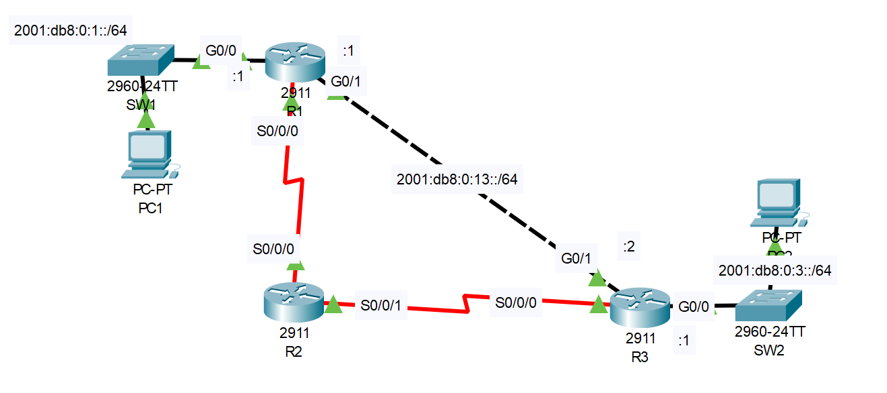

# IPv6 Static Routes

## Introduction

### Packet Tracer

[Download Day 33 Lab - IPv6 Static Routes](/JITL/Day%2033%20Lab%20-%20IPv6%20Static%20Routes.pkt){:download="Day 33 Lab - IPv6 Static Routes}

### Topology

<figure markdown>
  { width="800" }
  <figcaption></figcaption>
</figure>

### Questions

IPv6 addresses have been pre-configured on the routers.
The serial connections use link-local addresses only.

1. Enable IPv6 routing on each router.

2. Use SLAAC to configure IPv6 addresses on the PCs.
    What IPv6 address was configured on each PC?

3. Configure static routes on the routers to allow PC1 and PC2 to ping each other. The path via R2 should be used only as a backup path.

## Answers


??? "1. Enable IPv6 routing on each router."

    === "R1"

        ``` bash
        R1(config)#ipv6 unicast-routing 
        ```

    === "R2"

        ``` bash
        R2(config)#ipv6 unicast-routing 
        ```
            
    === "R3"

        ``` bash
        R3(config)#ipv6 unicast-routing 
        ```


??? "2. Use SLAAC to configure IPv6 addresses on the PCs. What IPv6 address was configured on each PC?"


    When we switch the PC's Gateway to Automatic, there's an IP address automatically filled in. This must be R1's Link-Local address that it learned from the NDP router advertisement messages.

    When we do the same for the PCs IPV6 address, we see that an ipv6 address is automatically filled in. It learns the network prefix from R1 and the second half was generated using EUI-64.

    Note: This won't work if you forget to enable IPv6 routing on the routers


??? "3. Configure static routes on the routers to allow PC1 and PC2 to ping each other. The path via R2 should be used only as a backup path."

    === "R1"

        ``` bash
        R1(config)#ipv6 route 2001:db8:0:3::/64 g0/1 2001:db8:0:13::2
        R1(config)#ipv6 route 2001:db8:0:3::/64 s0/0/0 FE80::20B:BEFF:FED7:4901 5
        ```

        Note: A static route has a default administrative distance of 1. So we'll need to change the AD of the serial route to something higher, in this case we'll set it to 5

        ??? abstract "Confirm"

            We'll check the routing table to make sure our static route is in there.

            ``` bash
            R1(config)#do show ipv6 route
            IPv6 Routing Table - 6 entries
            Codes: C - Connected, L - Local, S - Static, R - RIP, B - BGP
                U - Per-user Static route, M - MIPv6
                I1 - ISIS L1, I2 - ISIS L2, IA - ISIS interarea, IS - ISIS summary
                ND - ND Default, NDp - ND Prefix, DCE - Destination, NDr - Redirect
                O - OSPF intra, OI - OSPF inter, OE1 - OSPF ext 1, OE2 - OSPF ext 2
                ON1 - OSPF NSSA ext 1, ON2 - OSPF NSSA ext 2
                D - EIGRP, EX - EIGRP external
            C   2001:DB8:0:1::/64 [0/0]
                via GigabitEthernet0/0, directly connected
            L   2001:DB8:0:1::1/128 [0/0]
                via GigabitEthernet0/0, receive
            S   2001:DB8:0:3::/64 [1/0]
                via 2001:DB8:0:13::2, GigabitEthernet0/1
            C   2001:DB8:0:13::/64 [0/0]
                via GigabitEthernet0/1, directly connected
            L   2001:DB8:0:13::1/128 [0/0]
                via GigabitEthernet0/1, receive
            L   FF00::/8 [0/0]
                via Null0, receive
            ```

            Since it won't show both routes, we'll have to use another command to find the floating route.

            ``` bash
            R1(config)#do show run | include ipv6 route
            ipv6 route 2001:DB8:0:3::/64 GigabitEthernet0/1 2001:DB8:0:13::2
            ipv6 route 2001:DB8:0:3::/64 Serial0/0/0 FE80::20B:BEFF:FED7:4901 5
            ```

    === "R2"

        ``` bash
        R2(config)#ipv6 route 2001:db8:0:1::/64 s0/0/0 FE80::202:4AFF:FE23:E201
        R2(config)#ipv6 route 2001:db8:0:3::/64 s0/0/1 FE80::290:2BFF:FECC:A101
        ```
            
    === "R3"

        ``` bash
        R3(config)#ipv6 route 2001:db8:0:1::/64 g0/1 2001:db8:0:13::1
        R3(config)#ipv6 route 2001:db8:0:1::/64 s0/0/0 FE80::20B:BEFF:FED7:4901 5
        ```

## Commands

* `spanning-tree portfast `
* `spanning-tree link-type point-to-point `

  