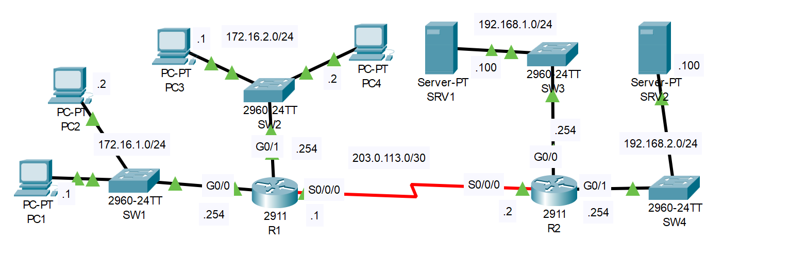

# Standard ACLs

## Introduction

### Packet Tracer

[Download Day 34 Lab - Standard ACLs](/JITL/Day%2034%20Lab%20-%20Standard%20ACLs.pkt){:download="Day 34 Lab - Standard ACLs}

### Topology

<figure markdown>
  { width="800" }
  <figcaption></figcaption>
</figure>

### Questions

1. Configure OSPF on R1 and R2 to allow full connectivity between the PCs and servers.

2. Configure standard numbered ACLS on R1 and standard named ACLs on R2 to fulfill the following network policies:
    - Only PC1 and PC3 can access 192.168.1.0/24
    - Hosts in 172.16.2.0/24 can't access 192.168.2.0/24
    - 172.16.1.0/24 can't access 172.16.2.0/24
    - 172.16.2.0/24 can't access 172.16.1.0/24

## Answers


??? "1. Configure OSPF on R1 and R2 to allow full connectivity between the PCs and servers."

    === "R1"

        ``` bash
        R1>
        R1>en
        R1#conf t
        Enter configuration commands, one per line.  End with CNTL/Z.
        R1(config)#router ospf 1
        R1(config-router)#network 172.16.0.0 0.0.255.255 area 0
        R1(config-router)#net 203.0.113.0 0.0.0.3 area 0
        ```

        ??? abstract "Confirm"

            Notice that all 3 interfaces shows up/up so we got them all

            ``` bash
            R1(config-router)#do show ip ospf int

            GigabitEthernet0/0 is up, line protocol is up
            Internet address is 172.16.1.254/24, Area 0
            Process ID 1, Router ID 203.0.113.1, Network Type BROADCAST, Cost: 1
            Transmit Delay is 1 sec, State WAITING, Priority 1
            No designated router on this network
            No backup designated router on this network
            Timer intervals configured, Hello 10, Dead 40, Wait 40, Retransmit 5
                Hello due in 00:00:06
            Index 1/1, flood queue length 0
            Next 0x0(0)/0x0(0)
            Last flood scan length is 1, maximum is 1
            Last flood scan time is 0 msec, maximum is 0 msec
            Neighbor Count is 0, Adjacent neighbor count is 0
            Suppress hello for 0 neighbor(s)
            GigabitEthernet0/1 is up, line protocol is up
            Internet address is 172.16.2.254/24, Area 0
            Process ID 1, Router ID 203.0.113.1, Network Type BROADCAST, Cost: 1
            Transmit Delay is 1 sec, State WAITING, Priority 1
            No designated router on this network
            No backup designated router on this network
            Timer intervals configured, Hello 10, Dead 40, Wait 40, Retransmit 5
                Hello due in 00:00:06
            Index 2/2, flood queue length 0
            Next 0x0(0)/0x0(0)
            Last flood scan length is 1, maximum is 1
            Last flood scan time is 0 msec, maximum is 0 msec
            Neighbor Count is 0, Adjacent neighbor count is 0
            Suppress hello for 0 neighbor(s)
            Serial0/0/0 is up, line protocol is up
            Internet address is 203.0.113.1/30, Area 0
            Process ID 1, Router ID 203.0.113.1, Network Type POINT-TO-POINT, Cost: 64
            Transmit Delay is 1 sec, State POINT-TO-POINT,
            Timer intervals configured, Hello 10, Dead 40, Wait 40, Retransmit 5
                Hello due in 00:00:04
            Index 3/3, flood queue length 0
            Next 0x0(0)/0x0(0)
            Last flood scan length is 1, maximum is 1
            Last flood scan time is 0 msec, maximum is 0 msec
            Suppress hello for 0 neighbor(s)
            R1(config-router)#
            ```

    === "R2"

        ``` bash
        R2>
        R2>en
        R2#conf t
        Enter configuration commands, one per line.  End with CNTL/Z.
        R2(config)#int range g0/0, g0/1
        R2(config-if-range)#ip ospf 1 area 0
        R2(config-if-range)#int s0/0/0
        R2(config-if)#ip ospf 1 area 0
        ```

        ??? abstract "Confirm"

            ``` bash
            R2(config-if)#do show ip ospf int

            GigabitEthernet0/0 is up, line protocol is up
            Internet address is 192.168.1.254/24, Area 0
            Process ID 1, Router ID 203.0.113.2, Network Type BROADCAST, Cost: 1
            Transmit Delay is 1 sec, State WAITING, Priority 1
            No designated router on this network
            No backup designated router on this network
            Timer intervals configured, Hello 10, Dead 40, Wait 40, Retransmit 5
                Hello due in 00:00:02
            Index 1/1, flood queue length 0
            Next 0x0(0)/0x0(0)
            Last flood scan length is 1, maximum is 1
            Last flood scan time is 0 msec, maximum is 0 msec
            Neighbor Count is 0, Adjacent neighbor count is 0
            Suppress hello for 0 neighbor(s)
            GigabitEthernet0/1 is up, line protocol is up
            Internet address is 192.168.2.254/24, Area 0
            Process ID 1, Router ID 203.0.113.2, Network Type BROADCAST, Cost: 1
            Transmit Delay is 1 sec, State WAITING, Priority 1
            No designated router on this network
            No backup designated router on this network
            Timer intervals configured, Hello 10, Dead 40, Wait 40, Retransmit 5
                Hello due in 00:00:02
            Index 2/2, flood queue length 0
            Next 0x0(0)/0x0(0)
            Last flood scan length is 1, maximum is 1
            Last flood scan time is 0 msec, maximum is 0 msec
            Neighbor Count is 0, Adjacent neighbor count is 0
            Suppress hello for 0 neighbor(s)
            Serial0/0/0 is up, line protocol is up
            Internet address is 203.0.113.2/30, Area 0
            Process ID 1, Router ID 203.0.113.2, Network Type POINT-TO-POINT, Cost: 64
            Transmit Delay is 1 sec, State POINT-TO-POINT,
            Timer intervals configured, Hello 10, Dead 40, Wait 40, Retransmit 5
                Hello due in 00:00:00
            Index 3/3, flood queue length 0
            Next 0x0(0)/0x0(0)
            Last flood scan length is 1, maximum is 1
            Last flood scan time is 0 msec, maximum is 0 msec
            Neighbor Count is 1 , Adjacent neighbor count is 1
                Adjacent with neighbor 203.0.113.1
            Suppress hello for 0 neighbor(s)
            R2(config-if)#
            ```


??? "2. Configure standard numbered ACLS on R1 and standard named ACLs on R2 to fulfill the following network policies:"

    - Only PC1 and PC3 can access 192.168.1.0/24
    - Hosts in 172.16.2.0/24 can't access 192.168.2.0/24
    - 172.16.1.0/24 can't access 172.16.2.0/24
    - 172.16.2.0/24 can't access 172.16.1.0/24

    Standard ACLs should be configured as close to the destination as possible. So for the first requirement, let's configure R2

    ``` bash
    R2#
    R2#conf t
    Enter configuration commands, one per line.  End with CNTL/Z.

    ! First, create the access list. 
    R2(config)#ip access-list standard TO_192.168.1.0/24
    R2(config-std-nacl)#permit 172.16.1.1
    R2(config-std-nacl)#permit 172.16.2.1
    R2(config-std-nacl)#deny any

    ! Then apply it
    R2(config-std-nacl)#int g0/0
    R2(config-if)#ip access-group TO_192.168.1.0/24 out
    ```

    Next, Hosts in 172.16.2.0/24 can't access 192.168.2.0/24

    ``` bash
    R2#conf t
    Enter configuration commands, one per line.  End with CNTL/Z.

    R2(config)#ip access-list standard TO_192.168.2.0/24
    R2(config-std-nacl)#deny 172.16.2.0 0.0.0.255
    R2(config-std-nacl)#permit any
    R2(config-std-nacl)#

    R2(config-std-nacl)#int g0/1
    R2(config-if)#ip access-group TO_192.168.2.0/24 out
    ```

    To stop the two subnets from communicating, let's configure R1:

    ``` bash
    R1>en
    R1#conf t
    Enter configuration commands, one per line.  End with CNTL/Z.

    ! Numbered access list
    R1(config)#access-list 1 deny 172.16.1.0 0.0.0.255
    R1(config)#access-list 1 permit any
    R1(config)#access-list 2 deny 172.16.2.0 0.0.0.255
    R1(config)#access-list 2 permit any
    
    R1(config-if)#int g0/1
    R1(config-if)#ip access-group 1 out
    R1(config-if)#int g0/0
    R1(config-if)#ip access-group 2 out
    ```


    ??? abstract "To look at the lists we've created"

        ``` bash
        R2#show access-lists 
        Standard IP access list TO_192.168.1.0/24
            10 permit host 172.16.1.1 (1 match(es))
            20 permit host 172.16.2.1 (1 match(es))
            30 deny any (1 match(es))
        Standard IP access list TO_192.168.2.0/24
            10 deny 172.16.2.0 0.0.0.255 (1 match(es))
            20 permit any

        R2#
        ```

## Commands


  