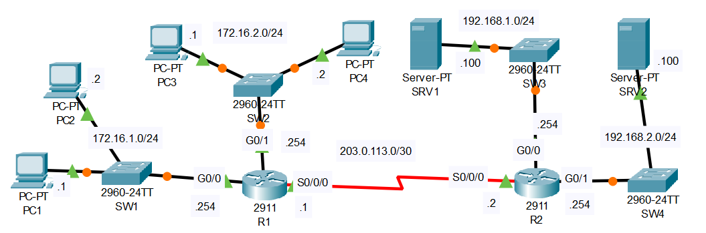

# Extended ACLs

## Introduction

### Packet Tracer

[Download Day 35 Lab - Extended ACLs](../assets/packet-tracer-files/Day%2035%20Lab%20-%20Extended%20ACLs.pkt){:download="Day 35 Lab - Extended ACLs.pkt"}

### Topology

<figure markdown>
  { width="800" }
  <figcaption></figcaption>
</figure>

### Questions

1. Configure extended ACLS to fulfill the following network policies:
    - Hosts in 172.16.2.0/24 can't communicate with PC1.
    - Hosts in 172.16.1.0/24 can't access the DNS service on SRV1.
    - Hosts in 172.16.2.0/24 can't access the HTTP or HTTPS services on SRV2.

## Answers


??? "1. Configure extended ACLS to fulfill the following network policies:"

    - Hosts in 172.16.2.0/24 can't communicate with PC1.
    - Hosts in 172.16.1.0/24 can't access the DNS service on SRV1.
    - Hosts in 172.16.2.0/24 can't access the HTTP or HTTPS services on SRV2.

    First, we'll take care of the DNS requirement in R1

    ``` bash
    R1>
    R1>en
    R1#conf t
    Enter configuration commands, one per line.  End with CNTL/Z.

    ! <action> <protocol> <src ip> <src port> <dest ip> <dest port>
    R1(config)#ip access-list extended 100
    R1(config-ext-nacl)#deny udp 172.16.1.0 0.0.0.255 host 192.168.1.100 eq 53
    R1(config-ext-nacl)#deny tcp 172.16.1.0 0.0.0.255 host 192.168.1.100 eq 53
    R1(config-ext-nacl)#permit ip any any
    R1(config-ext-nacl)#

    ! For extended lists, we apply it close to the source
    R1(config-ext-nacl)#int g0/0
    R1(config-if)#ip access-group 100 in
    ```
    To test this, from PC1 "ping srv2" won't work since DNS is block but "ping 192.168.2.100" will work

    Now, let's do requirements 1 and 3 since they both come from the same source:

    ``` bash
    R1#conf t
    Enter configuration commands, one per line.  End with CNTL/Z.

    R1(config)#ip access-list extended 101
    R1(config-ext-nacl)#deny ip 172.16.2.0 0.0.0.255 host 172.16.1.1
    R1(config-ext-nacl)#deny tcp 172.16.2.0 0.0.0.255 host 192.168.2.100 eq 80
    R1(config-ext-nacl)#deny tcp 172.16.2.0 0.0.0.255 host 192.168.2.100 eq 443
    R1(config-ext-nacl)#permit ip any any

    R1(config-ext-nacl)#int g0/1
    R1(config-if)#ip access-group 101 in
    ```

## Commands

* `spanning-tree portfast `
* `spanning-tree link-type point-to-point `

  