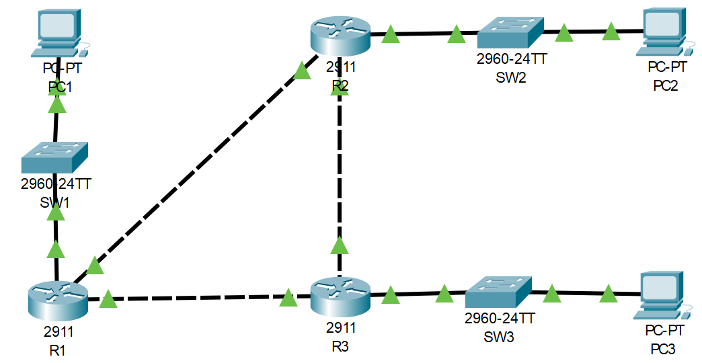

# CDP and LLDP

## Introduction

### Packet Tracer

[Download Day 36 Lab - CDP and LLDP](../assets/packet-tracer-files/Day%2036%20Lab%20-%20CDP%20_%20LLDP.pkt){:download="Day 36 Lab - CDP and LLDP.pkt"}

### Topology

<figure markdown>
  { width="800" }
  <figcaption></figcaption>
</figure>

### Questions

1. Use CDP (and other commands) to identify and label the missing IP addresses and interface IDs of the devices in the network.

2. Disable CDP on the switch interfaces currently connected to PCs.

3. Disable CDP globally on each network device.

4. Enable LLDP globally on each network device, and enable Tx/Rx on the interfaces connected to other network devices. Tx/Rx are currently disabled on all interfaces

## Answers


??? "1. Use CDP (and other commands) to identify and label the missing IP addresses and interface IDs of the devices in the network."

    === "SW1"

        Since PC1 doesn't use CDP, we'll have to use 'show interface status'

        ``` bash
        SW1#show cdp neighbors 
        Capability Codes: R - Router, T - Trans Bridge, B - Source Route Bridge
                        S - Switch, H - Host, I - IGMP, r - Repeater, P - Phone
        Device ID    Local Intrfce   Holdtme    Capability   Platform    Port ID
        R1           Gig 0/1          172            R       C2900       Gig 0/2
        SW1#
        SW1#show int stat
        Port      Name               Status       Vlan       Duplex  Speed Type
        Fa0/1                        notconnect   1          auto    auto  10/100BaseTX
        Fa0/2                        notconnect   1          auto    auto  10/100BaseTX
        Fa0/3                        notconnect   1          auto    auto  10/100BaseTX
        Fa0/4                        notconnect   1          auto    auto  10/100BaseTX
        Fa0/5                        notconnect   1          auto    auto  10/100BaseTX
        Fa0/6                        notconnect   1          auto    auto  10/100BaseTX
        Fa0/7                        notconnect   1          auto    auto  10/100BaseTX
        Fa0/8                        notconnect   1          auto    auto  10/100BaseTX
        Fa0/9                        notconnect   1          auto    auto  10/100BaseTX
        Fa0/10                       connected    1          auto    auto  10/100BaseTX
        Fa0/11                       notconnect   1          auto    auto  10/100BaseTX
        Fa0/12                       notconnect   1          auto    auto  10/100BaseTX
        Fa0/13                       notconnect   1          auto    auto  10/100BaseTX
        Fa0/14                       notconnect   1          auto    auto  10/100BaseTX
        Fa0/15                       notconnect   1          auto    auto  10/100BaseTX
        Fa0/16                       notconnect   1          auto    auto  10/100BaseTX
        Fa0/17                       notconnect   1          auto    auto  10/100BaseTX
        Fa0/18                       notconnect   1          auto    auto  10/100BaseTX
        Fa0/19                       notconnect   1          auto    auto  10/100BaseTX
        Fa0/20                       notconnect   1          auto    auto  10/100BaseTX
        Fa0/21                       notconnect   1          auto    auto  10/100BaseTX
        Fa0/22                       notconnect   1          auto    auto  10/100BaseTX
        Fa0/23                       notconnect   1          auto    auto  10/100BaseTX
        Fa0/24                       notconnect   1          auto    auto  10/100BaseTX
        Gig0/1                       connected    1          auto    auto  10/100BaseTX
        Gig0/2                       notconnect   1          auto    auto  10/100BaseTX

        SW1#
        ```

    === "R1"

        Using a combination of show cdp nei and show int g0/0 you can figure out the ports and the subnet

        ``` bash
        R1#show cdp nei
        Capability Codes: R - Router, T - Trans Bridge, B - Source Route Bridge
                        S - Switch, H - Host, I - IGMP, r - Repeater, P - Phone
        Device ID    Local Intrfce   Holdtme    Capability   Platform    Port ID
        SW1          Gig 0/2          167            S       2960        Gig 0/1
        R3           Gig 0/0          167            R       C2900       Gig 0/1
        R2           Gig 0/1          167            R       C2900       Gig 0/0
        R1#show int g0/0
        GigabitEthernet0/0 is up, line protocol is up (connected)
        Hardware is CN Gigabit Ethernet, address is 0010.119d.2501 (bia 0010.119d.2501)
        Internet address is 10.0.13.1/30
        MTU 1500 bytes, BW 1000000 Kbit, DLY 10 usec,
            reliability 255/255, txload 1/255, rxload 1/255
        Encapsulation ARPA, loopback not set
        Keepalive set (10 sec)
        Full-duplex, 100Mb/s, media type is RJ45
        output flow-control is unsupported, input flow-control is unsupported
        ARP type: ARPA, ARP Timeout 04:00:00, 
        Last input 00:00:08, output 00:00:05, output hang never
        Last clearing of "show interface" counters never
        Input queue: 0/75/0 (size/max/drops); Total output drops: 0
        Queueing strategy: fifo
        Output queue :0/40 (size/max)
        5 minute input rate 102 bits/sec, 0 packets/sec
        5 minute output rate 104 bits/sec, 0 packets/sec
            368 packets input, 22065 bytes, 0 no buffer
            Received 0 broadcasts, 0 runts, 0 giants, 0 throttles
            0 input errors, 0 CRC, 0 frame, 0 overrun, 0 ignored, 0 abort
            0 watchdog, 1017 multicast, 0 pause input
            0 input packets with dribble condition detected
            363 packets output, 21816 bytes, 0 underruns
            0 output errors, 0 collisions, 1 interface resets
            0 unknown protocol drops
            0 babbles, 0 late collision, 0 deferred
            0 lost carrier, 0 no carrier
            0 output buffer failures, 0 output buffers swapped out

        R1#
        ```


??? "2. Disable CDP on the switch interfaces currently connected to PCs."

    === "SW1"

        ``` bash
        SW1#
        SW1#conf t
        Enter configuration commands, one per line.  End with CNTL/Z.
        SW1(config)#int f0/10
        SW1(config-if)#no cdp enable
        ```

        ??? abstract "Confirm"

            ``` bash
            SW1(config-if)#do show cdp int f0/10
            SW1(config-if)#
            ```

??? "3. Disable CDP globally on each network device. and enable LLDP Tx and Rx"

    === "SW1"

        ``` bash
        SW1#
        SW1#conf t
        Enter configuration commands, one per line.  End with CNTL/Z.
        SW1(config)#no cdp run
        SW1(config)#lldp run

        SW1(config)#int g0/1
        SW1(config-if)#lldp transmit 
        SW1(config-if)#lldp receive 
        SW1(config-if)#
        ```

    === "R3"

        ``` bash
        R3>en
        R3#conf t
        Enter configuration commands, one per line.  End with CNTL/Z.
        R3(config)#no cdp run
        R3(config)#lldp run

        R3(config)#int range g0/0-2
        R3(config-if-range)#lldp tran
        R3(config-if-range)#lldp receive 
        R3(config-if-range)#
        ```


## Commands

* `show cdp entry R3`
* `show cdp neighbors`
* `no cdp enable`
* `no cdp run`

* `lldp run`
* `lldp transmit`
* `lldp receive`

  