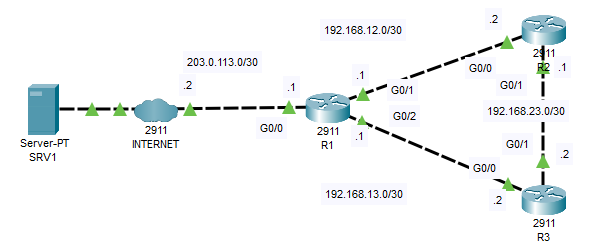

# NTP

## Introduction

### Packet Tracer

[Download Day 37 Lab - NTP](../assets/packet-tracer-files/Day%2037%20Lab%20-%20NTP.pkt){:download="Day 37 Lab - NTP.pkt"}

### Topology

<figure markdown>
  { width="800" }
  <figcaption></figcaption>
</figure>

### Questions

ROUTING HAS BEEN PRECONFIGURED
(default route on R1, OSPF on all routers with 'network 0.0.0.0 255.255.255.255 area 0')

1. Configure the software clock on R1, R2, and R3 to 12:00:00 Dec 30 2020 (UTC).

2. Configure the time zone of R1, R2, and R3 to match your own.

3. Configure R1 to synchronize to NTP server 1.1.1.1 over the Internet. What stratum is 1.1.1.1?  What stratum is R1?

4. Configure R1 as a stratum 8 NTP master. Synchronize R2 and R3 to R1 with authentication.
   *the 'ntp source' command is not available in Packet Tracer, so just use the physical interface IP addresses of R1.

5. Configure NTP to update the hardware calendars of R1, R2, and R3. *you can't view the calendar in Packet Tracer

## Answers


??? "1. Configure the software clock on R1, R2, and R3 to 12:00:00 Dec 30 2020 (UTC)."

    === "R1"

        ``` bash
        R1>en
        R1#clock set 12:00:00 Dec 30 2020
        ```

    === "R2"

        ``` bash
        R2>en
        R2#clock set 12:00:00 Dec 30 2020
        ```

    === "R3"

        ``` bash
        R3>en
        R3#clock set 12:00:00 Dec 30 2020
        ```


??? "2. Configure the time zone of R1, R2, and R3 to match your own."

    === "R1"

        ``` bash
        R1(config)#clock timezone EST -5
        ```

        ??? abstract "Confirm"

            ``` bash
            R1#show clock detail
            7:0:55.856 EST Wed Dec 30 2020
            Time source is user configuration
            R1#
            ```

    === "R2"

        ``` bash
        R3(config)#clock timezone EST -5
        ```

        ??? abstract "Confirm"

            ``` bash
            R3#show clock detail
            7:0:55.856 EST Wed Dec 30 2020
            Time source is user configuration
            R3#
            ```

    === "R3"

        ``` bash
        R3(config)#clock timezone EST -5
        ```

        ??? abstract "Confirm"

            ``` bash
            R3#show clock detail
            7:0:55.856 EST Wed Dec 30 2020
            Time source is user configuration
            R3#
            ```

??? "3. Configure R1 to synchronize to NTP server 1.1.1.1 over the Internet. What stratum is 1.1.1.1?  What stratum is R1?"

    === "R1"

        ``` bash
        R1(config)#ntp server 1.1.1.1
        ```

        ??? abstract "Confirm"

            Note that we don't see the sys.peer asterisk yet but instead we see a (~). We'll just fast forward on packet tracer a bit and should show.

            ``` bash
            R1(config)#do show ntp associations

            address         ref clock       st   when     poll    reach  delay          offset            disp
            ~1.1.1.1       .INIT.          16   -        64      0      0.00           0.00              0.01
            * sys.peer, # selected, + candidate, - outlyer, x falseticker, ~ configured
            R1(config)#
            ```

        ??? abstract "What stratum is 1.1.1.1"

            We can see in the "st" column that it says 1. Therefore it is stratum 1.

            ``` bash
            R1(config)#
            do show ntp associations

            address         ref clock       st   when     poll    reach  delay          offset            disp
            *~1.1.1.1       127.127.1.1     1    56       64      377    0.00           0.00              0.24
            * sys.peer, # selected, + candidate, - outlyer, x falseticker, ~ configured
            R1(config)#
            R1#
            ```

        ??? abstract "What stratum is R1"

            So now that R1 is an NTP client, it is also a server.
            We can see from the first line that it is stratum 2 and also the time source changed to NTP.

            ``` bash
            R1#show ntp status

            Clock is synchronized, stratum 2, reference is 1.1.1.1
            nominal freq is 250.0000 Hz, actual freq is 249.9990 Hz, precision is 2**24
            reference time is E3695787.00000349 (22:21:59.841 UTC Tue Dec 29 2020)
            clock offset is 0.00 msec, root delay is 0.00  msec
            root dispersion is 10.71 msec, peer dispersion is 0.48 msec.
            loopfilter state is 'CTRL' (Normal Controlled Loop), drift is - 0.000001193 s/s system poll interval is 6, last update was 61 sec ago.

            R1#show clock detail

            17:23:7.165 EST Tue Dec 29 2020
            Time source is NTP
            ```

??? "4. Configure R1 as a stratum 8 NTP master. Synchronize R2 and R3 to R1 with authentication."

    The reason why we're doing this is because, even though R1 is already a server we still need it to be able to act as a master in case R1 stops being able to sync to 1.1.1.1. It will then serve as a backup clock for R2 and R3 to sync to.

    === "R1"

        First set it as master (default stratum is 8)

        ``` bash
        R1(config)#ntp master
        ```

        Then, configure auth

        ``` bash
        R1#
        R1#conf t
        Enter configuration commands, one per line.  End with CNTL/Z.

        R1(config)#ntp authenticate
        R1(config)#ntp authentication-key 1 md5 Password12345$
        R1(config)#ntp trusted-key 1
        R1(config)#
        ```
        

    === "R2"

        ``` bash
        R2>
        R2>en
        R2#conf t
        Enter configuration commands, one per line.  End with CNTL/Z.

        R2(config)#ntp authenticate
        R2(config)#ntp authentication-key 1 md5 Password12345$
        R2(config)#ntp trusted-key 1

        R2(config)#ntp server 192.168.12.1 key 1
        ```

        ??? abstract "Confirm"

            ``` bash
            R2#show ntp associations 

            address         ref clock       st   when     poll    reach  delay          offset            disp
            *~192.168.12.1  1.1.1.1         2    26       32      377    0.00           0.00              0.12
            * sys.peer, # selected, + candidate, - outlyer, x falseticker, ~ configured

            R2#show clock detail

            17:33:36.921 est Tue Dec 29 2020
            Time source is NTP
            R2#
            ```

    === "R3"

        ``` bash
        R3>
        R3>en
        R3#conf t
        Enter configuration commands, one per line.  End with CNTL/Z.
        R3(config)#ntp authenticate
        R3(config)#ntp authentication-key 1 md5 Password12345$
        R3(config)#ntp trusted-key 1

        R3(config)#ntp server 192.168.12.1 key 1
        ```

        ??? abstract "Confirm"

            ``` bash
            R3(config)#do show ntp ass

            address         ref clock       st   when     poll    reach  delay          offset            disp
            ~192.168.12.1  1.1.1.1         2    25       64      21     0.00           0.00              0.00
            *~192.168.13.1  1.1.1.1         2    56       64      377    0.00           0.00              0.24
            * sys.peer, # selected, + candidate, - outlyer, x falseticker, ~ configured

            R3(config)#do show clock detail

            17:43:19.707 est Tue Dec 29 2020
            Time source is NTP
            ```

??? "5. Configure NTP to update the hardware calendars of R1, R2, and R3. *you can't view the calendar in Packet Tracer"

    === "R1"

        ``` bash

        ```

        ??? abstract "Confirm"

            ``` bash

            ```

    === "R2"

        ``` bash
        R2(config)#ntp update-calendar 
        ```

    === "R3"

        ``` bash

        ```

        ??? abstract "Confirm"

            ``` bash

            ```

## Commands

* `spanning-tree portfast `
* `spanning-tree link-type point-to-point `

  