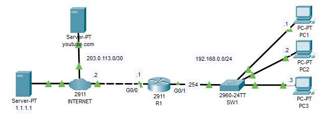

# DNS

## Introduction

### Packet Tracer

[Download Day 38 Lab - DNS](../assets/packet-tracer-files/Day%2038%20Lab%20-%20DNS.pkt){:download="Day 38 Lab - DNS.pkt"}

### Topology

<figure markdown>
  { width="800" }
  <figcaption></figcaption>
</figure>

### Questions

1. Configure a default route to the Internet on R1.

2. Configure PC1, PC2, and PC3 to use 1.1.1.1 as their DNS server.

3. Configure R1 to use 1.1.1.1 as its DNS server. Configure host entries on R1 for R1, PC1, PC2, and PC3.
    Ping PC1 by name from R1.

4. USE SIMULATION MODE FOR THIS STEP
    From PC1, ping youtube.com by name.  Analyze the messages being sent.

## Answers


??? "1. Configure a default route to the Internet on R1."

    ``` bash
    R1(config)#ip route 0.0.0.0 0.0.0.0 203.0.113.2
    ```


??? "2. Configure PC1, PC2, and PC3 to use 1.1.1.1 as their DNS server."

    === "PC1"

        ``` bash
        DNS: 1.1.1.1
        ```

    === "PC2"

        ``` bash
        DNS: 1.1.1.1
        ```

    === "PC3"

        ``` bash
        DNS: 1.1.1.1
        ```

??? "3. Configure R1 to use 1.1.1.1 as its DNS server. Configure host entries on R1 for R1, PC1, PC2, and PC3."

    ``` bash
    R1#
    R1#conf t
    Enter configuration commands, one per line.  End with CNTL/Z.

    R1(config)#ip name-server 1.1.1.1

    R1(config)#ip host R1 192.168.0.254
    R1(config)#ip host PC1 192.168.0.1
    R1(config)#ip host PC2 192.168.0.2
    R1(config)#ip host PC3 192.168.0.3
    R1(config)#
    ```

    ??? abstract "Confirm"

        ``` bash
        R1(config)#do show hosts
        Default Domain is not set
        Name/address lookup uses domain service
        Name servers are 1.1.1.1

        Codes: UN - unknown, EX - expired, OK - OK, ?? - revalidate
            temp - temporary, perm - permanent
            NA - Not Applicable None - Not defined

        Host                      Port  Flags      Age Type   Address(es)
        PC1                       None  (perm, OK)  0   IP      192.168.0.1
        PC2                       None  (perm, OK)  0   IP      192.168.0.2
        PC3                       None  (perm, OK)  0   IP      192.168.0.3
        R1                        None  (perm, OK)  0   IP      192.168.0.254
        R1(config)#
        ```

## Commands

* `ip name-server 1.1.1.1`
* `ip host PC1 192.168.0.1`

  