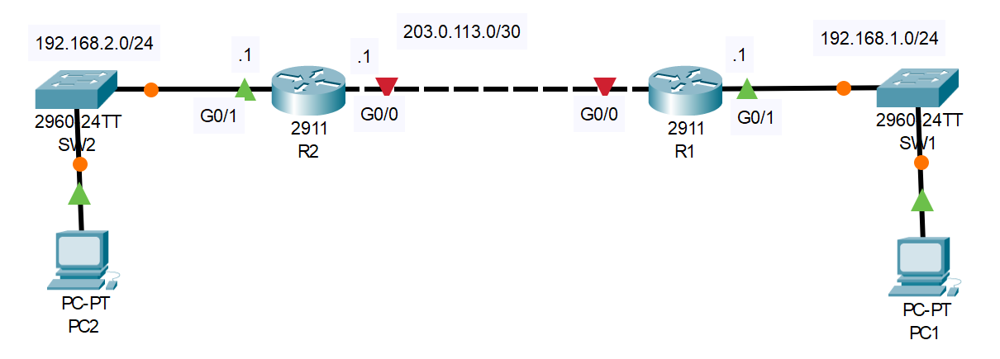

# DHCP

## Introduction

### Packet Tracer

[Download Day 39 Lab - DHCP](/JITL/Day%2039%20Lab%20-%20DHCP.pkt){:download="Day 39 Lab - DHCP}

### Topology

<figure markdown>
  { width="800" }
  <figcaption></figcaption>
</figure>

### Questions

1. Configure the following DHCP pools on R2:
POOL1: 192.168.1.0/24 (reserve .1 to .10)
     DNS 8.8.8.8
     Domain: jeremysitlab.com
     Default Gateway: R1
POOL2: 192.168.2.0/24 (reserve .1 to .10)
     DNS 8.8.8.8
     Domain: jeremysitlab.com
     Default Gateway: R2
POOL3: 203.0.113.0/30 (reserve .1)

2. Configure R1's G0/0 interface as a DHCP client. What IP address did it configure?

3. Configure R1 as a DHCP relay agent for the 192.168.1.0/24 subnet.
 
4. Use the CLI of PC1 and PC2 to make them request an IP address 
    from their DHCP server.

## Answers


??? "1. Configure the following DHCP pools on R2:"

    - POOL1: 192.168.1.0/24 (reserve .1 to .10)
        - DNS 8.8.8.8
        - Domain: jeremysitlab.com
        - Default Gateway: R1
    - POOL2: 192.168.2.0/24 (reserve .1 to .10)
        - DNS 8.8.8.8
        - Domain: jeremysitlab.com
        - Default Gateway: R2
    - POOL3: 203.0.113.0/30 (reserve .1)

    ``` bash
    R2#conf t
    Enter configuration commands, one per line.  End with CNTL/Z.

    R2(config)#ip dhcp excluded-address 192.168.1.1 192.168.1.10
    R2(config)#ip dhcp excluded-address 192.168.2.1 192.168.2.10
    R2(config)#ip dhcp excluded-address 203.0.113.1

    R2(config)#ip dhcp pool POOL1
    R2(dhcp-config)#network 192.168.1.0 255.255.255.0
    R2(dhcp-config)#dns-server 8.8.8.8
    R2(dhcp-config)#domain-name davidslab.com
    R2(dhcp-config)#default-router 192.168.1.1

    R2(dhcp-config)#ip dhcp pool POOL2
    R2(dhcp-config)#network 192.168.2.0 255.255.255.0
    R2(dhcp-config)#dns-server 8.8.8.8
    R2(dhcp-config)#domain-name danslab.com
    R2(dhcp-config)#default-router 192.168.2.1

    R2(dhcp-config)#ip dhcp pool POOL3
    R2(dhcp-config)#network 203.0.113.0 255.255.255.252
    ```

    ??? abstract "Confirm"

        ``` bash
        R2(dhcp-config)#do show run | section dhcp

        ip dhcp excluded-address 192.168.1.1 192.168.1.10
        ip dhcp excluded-address 192.168.2.1 192.168.2.10
        ip dhcp excluded-address 203.0.113.1

        ip dhcp pool POOL1
        network 192.168.1.0 255.255.255.0
        default-router 192.168.1.1
        dns-server 8.8.8.8
        domain-name davidslab.com

        ip dhcp pool POOL2
        network 192.168.2.0 255.255.255.0
        default-router 192.168.2.1
        dns-server 8.8.8.8
        domain-name danslab.com
        
        ip dhcp pool POOL3
        network 203.0.113.0 255.255.255.252
        R2(dhcp-config)#
        ```

??? "2. Configure R1's G0/0 interface as a DHCP client. What IP address did it configure?"

    ``` bash
    R1>
    R1>en
    R1#conf t
    Enter configuration commands, one per line.  End with CNTL/Z.
    R1(config)#int g0/0
    R1(config-if)#ip address dhcp
    R1(config-if)#no shut

    R1(config-if)#
    %LINK-5-CHANGED: Interface GigabitEthernet0/0, changed state to up

    %LINEPROTO-5-UPDOWN: Line protocol on Interface GigabitEthernet0/0, changed state to up

    %DHCP-6-ADDRESS_ASSIGN: Interface GigabitEthernet0/0 assigned DHCP address 203.0.113.2, mask 255.255.255.252, hostname R1
    ```

??? "3. Configure R1 as a DHCP relay agent for the 192.168.1.0/24 subnet."

    ``` bash
    R1#conf t
    Enter configuration commands, one per line.  End with CNTL/Z.

    R1(config)#int g0/1
    R1(config-if)#ip helper-address 203.0.113.1
    ```

## Commands

* `spanning-tree portfast `
* `spanning-tree link-type point-to-point `

  