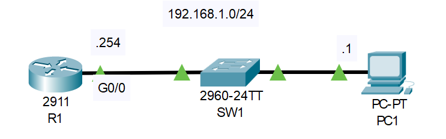

# SNMP

## Introduction

### Packet Tracer

[Download Day 40 Lab - SNMP](/JITL/Day%2040%20Lab%20-%20SNMP.pkt){:download="Day 40 Lab - SNMP}

### Topology

<figure markdown>
  { width="800" }
  <figcaption></figcaption>
</figure>

### Questions

SNMP functionality is VERY limited in Packet Tracer!

1. Configure the following SNMP communities on R1:
    - read-only: Cisco1
    - read/write: Cisco2

2. Use SNMP 'Get' messages via the MIB browser on PC1 to check the following:
    - How long has R1 been running? (system uptime)
    - What is the currently configured hostname on R1?
    - How many interfaces does R1 have?
    - What are those interfaces?
 
3. Use an SNMP 'Set' message from PC1 to change the hostname of R1.

## Answers


??? "1. Configure the following SNMP communities on R1:"

    - read-only: Cisco1
    - read/write: Cisco2

    ``` bash
    R1>
    R1>en
    R1#conf t
    Enter configuration commands, one per line.  End with CNTL/Z.

    R1(config)#snmp-server community Cisco1 ro
    %SNMP-5-WARMSTART: SNMP agent on host R1 is undergoing a warm start
    R1(config)#snmp-server community Cisco2 rw
    R1(config)#
    ```


??? "2. Use SNMP 'Get' messages via the MIB browser on PC1 to check the following:"

    - How long has R1 been running? (system uptime)
    - What is the currently configured hostname on R1?
    - How many interfaces does R1 have?
    - What are those interfaces?

    ??? abstract "Uptime"

        <figure markdown>
            { width="800" }
            <figcaption></figcaption>
        </figure>


??? "3. Use an SNMP 'Set' message from PC1 to change the hostname of R1."

    <figure markdown>
        { width="800" }
        <figcaption></figcaption>
    </figure>

## Commands

* `spanning-tree portfast `
* `spanning-tree link-type point-to-point `

  