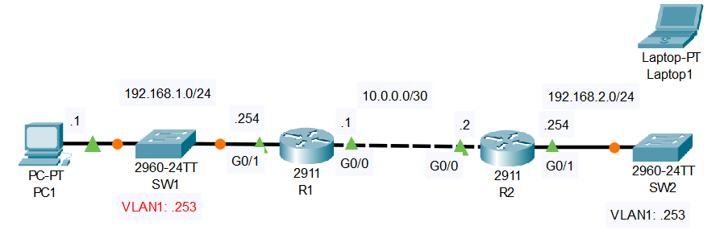

# SSH

## Introduction

### Packet Tracer

[Download Day 42 Lab - SSH](../assets/packet-tracer-files/Day%2042%20Lab%20-%20SSH.pkt){:download="Day 42 Lab - SSH.pkt"}

### Topology

<figure markdown>
  { width="800" }
  <figcaption></figcaption>
</figure>

### Questions

*SW2 has been newly added to the network, but has not yet been configured.  

1. Connect Laptop1 to SW2's console port to perform the following configurations:
    - Host name: SW2
    - Enable secret: ccna
    - Username/PW: jeremy/ccna
    - VLAN1 SVI: 192.168.2.253/24
    - Default gateway: R2

2. Configure the following console line security settings on SW2:
    - Authentication: Local user
    - Exec timeout: 5 minutes

3. Configure SW2 for remote access via SSH:
    - Domain name: jeremysitlab.com
    - RSA key size: 2048 bits
    - Authentication: Local user
    - Exec timeout: 5 minutes
    - Protocols: SSH only
    - Limit access to PC1 ONLY

## Answers


??? "1. Connect Laptop1 to SW2's console port to perform the following configurations:"

    - Host name: SW2
    - Enable secret: ccna
    - Username/PW: jeremy/ccna
    - VLAN1 SVI: 192.168.2.253/24
    - Default gateway: R2

    ``` bash
    Switch>
    Switch>en
    Switch#conf t
    Enter configuration commands, one per line.  End with CNTL/Z.
    Switch(config)#hostname SW2
    SW2(config)#enable secret ccna
    SW2(config)#username jeremy secret ccna
    SW2(config)#int vlan 1
    SW2(config-if)#ip add 192.168.2.253 255.255.255.0
    SW2(config-if)#no shut

    SW2(config-if)#
    %LINK-5-CHANGED: Interface Vlan1, changed state to up

    %LINEPROTO-5-UPDOWN: Line protocol on Interface Vlan1, changed state to up

    SW2(config-if)#exit

    SW2(config)#ip default-gateway 192.168.2.254
    SW2(config)#
    ```


??? "2. Configure the following console line security settings on SW2:"

    - Authentication: Local user
    - Exec timeout: 5 minutes

    ``` bash
    SW2(config)#
    SW2(config)#line con 0
    SW2(config-line)#login local
    SW2(config-line)#exec-timeout 5
    SW2(config-line)#
    ```

??? "3. Configure SW2 for remote access via SSH:"

    - Domain name: jeremysitlab.com
    - RSA key size: 2048 bits
    - Authentication: Local user
    - Exec timeout: 5 minutes
    - Protocols: SSH only
    - Limit access to PC1 ONLY

    ``` bash
    SW2>en
    Password: 
    SW2#conf t
    SW2(config)#ip domain-name jeremysitlab.com
    SW2(config)#crypto key generate rsa
    The name for the keys will be: SW2.jeremysitlab.com
    Choose the size of the key modulus in the range of 360 to 4096 for your
    General Purpose Keys. Choosing a key modulus greater than 512 may take
    a few minutes.

    How many bits in the modulus [512]: 2048
    % Generating 2048 bit RSA keys, keys will be non-exportable...[OK]

    *Feb 28 10:10:51.495: %SSH-5-ENABLED: SSH 1.99 has been enabled
    SW2(config)#access-list 1 permit host 192.168.1.1
      
    SW2(config)#line vty 0 15
    SW2(config-line)#login local
    SW2(config-line)#exec-timeout 5
    SW2(config-line)#transport input ssh

    SW2(config-line)#access-class 1 in
    SW2(config-line)#
    ```

## Commands

* `spanning-tree portfast `
* `spanning-tree link-type point-to-point `

  