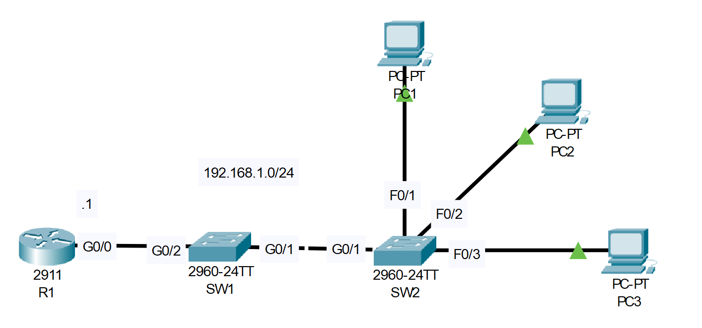

# DHCP Snoopping

## Introduction

### Packet Tracer

[Download Day 50 Lab - DHCP Snoopping](../assets/packet-tracer-files/Day%2050%20Lab%20-%20DHCP%20Snooping.pkt){:download="Day 50 Lab - DHCP Snoopping.pkt"}

### Topology

<figure markdown>
  { width="800" }
  <figcaption></figcaption>
</figure>

### Questions

1. Configure R1 as a DHCP server.
    - Exclude 192.168.1.1 - 192.168.1.9 from the pool
    - Default gateway: R1

2. Configure DHCP snooping on SW1 and SW2.
    - Configure the uplink interfaces as trusted ports.

3. Use IPCONFIG /RENEW on PC1 to get an IP address.
    - Does it work?  Why or why not?

4. If it doesn't work, make the necessary configuration change to fix it.

## Answers


??? "1. Configure R1 as a DHCP server."

    ``` bash
    R1>
    R1>en
    R1#conf t
    Enter configuration commands, one per line.  End with CNTL/Z.

    R1(config)#ip dhcp excluded-address 192.168.1.1 192.168.1.9
    R1(config)#ip dhcp pool POOL1
    R1(dhcp-config)#network 192.168.1.0 255.255.255.0
    R1(dhcp-config)#default-router 192.168.1.1
    R1(dhcp-config)#
    ```

??? "2. Configure DHCP snooping on SW1 and SW2."

    === "SW1"

        ``` bash
        SW1>
        SW1>en
        SW1#conf t
        Enter configuration commands, one per line.  End with CNTL/Z.

        SW1(config)#ip dhcp snooping vlan 1

        SW1(config)#int g0/2
        SW1(config-if)#ip dhcp snooping trust
        ```

    === "SW2"

        ``` bash
        SW2>
        SW2>en
        SW2#conf t
        Enter configuration commands, one per line.  End with CNTL/Z.

        SW2(config)#ip dhcp snooping vlan 1

        SW2(config)#int g0/1
        SW2(config-if)#ip dhcp snooping trust
        ```
            
??? "3. Use IPCONFIG /RENEW on PC1 to get an IP address."

    Does not work

??? "4. If it doesn't work, make the necessary configuration change to fix it."

    === "SW1"

        ``` bash
        SW1(config)#no ip dhcp snooping information option
        ```

    === "SW2"

        ``` bash
        SW2(config)#no ip dhcp snooping information option
        ```

    === "PC1"

        ``` bash
        C:\>ipconfig /renew
        ```

## Commands

* `spanning-tree portfast `
* `spanning-tree link-type point-to-point `

  