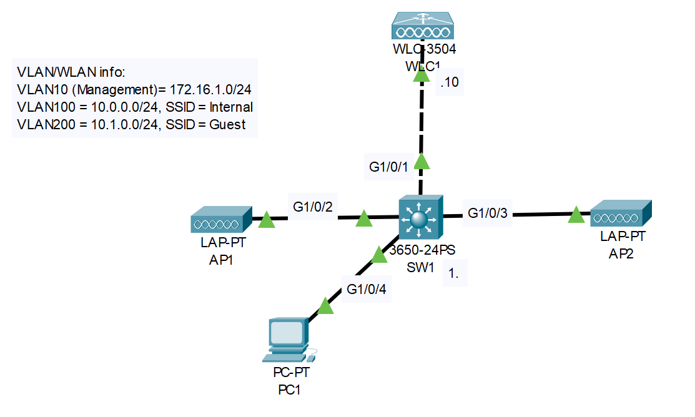

# Wireless LANs

## Introduction

### Packet Tracer

[Download Day 58 Lab - Wireless LANs](../assets/packet-tracer-files/Day%2058%20Lab%20-%20Wireless%20LANs.pkt){:download="Day 58 Lab - Wireless LANs.pkt"}

### Topology

<figure markdown>
  { width="800" }
  <figcaption></figcaption>
</figure>

### Questions

*End host and SVI IP addresses are pre-configured*

1. Check the routing tables of R1 and R2.  Which dynamic routing protocol is Enterprise A using?
    Which route will be used if PC1 tries to access SRV1?
    Which route will be used if PC1 tries to access remote server 1.1.1.1 over the Internet?
    Test by pinging SRV1 and 1.1.1.1

2. Configure floating static routes on R1 and R2 that allow PC1 to reach SRV1 if the link between R1 and R2 fails.
    Do the routes enter the routing tables of R1 and R2?

3. Shut down the G0/2/0 interface of R1 or R2.
    Do the floating static routes enter the routing tables of R1 and R2?
    Ping from PC1 to SRV1 to confirm.

## Answers


??? "1. aaaa"

    === "ASW1"

        ``` bash

        ```

        ??? abstract "Confirm"

            ``` bash

            ```

    === "DSW1"

        ``` bash

        ```

        ??? abstract "Confirm"

            ``` bash

            ```

??? "2. bbbb"

    === "ASW1"

        ``` bash

        ```

        ??? abstract "Confirm"

            ``` bash

            ```

    === "DSW1"

        ``` bash

        ```

        ??? abstract "Confirm"

            ``` bash

            ```
            
??? "3. ccccc"

    === "ASW1"

        ``` bash

        ```

        ??? abstract "Confirm"

            ``` bash

            ```

    === "DSW1"

        ``` bash

        ```

        ??? abstract "Confirm"

            ``` bash

            ```

??? "4. ddddd"

    === "ASW1"

        ``` bash

        ```

        ??? abstract "Confirm"

            ``` bash

            ```

    === "DSW1"

        ``` bash

        ```

        ??? abstract "Confirm"

            ``` bash

            ```

## Commands

* `spanning-tree portfast `
* `spanning-tree link-type point-to-point `

  